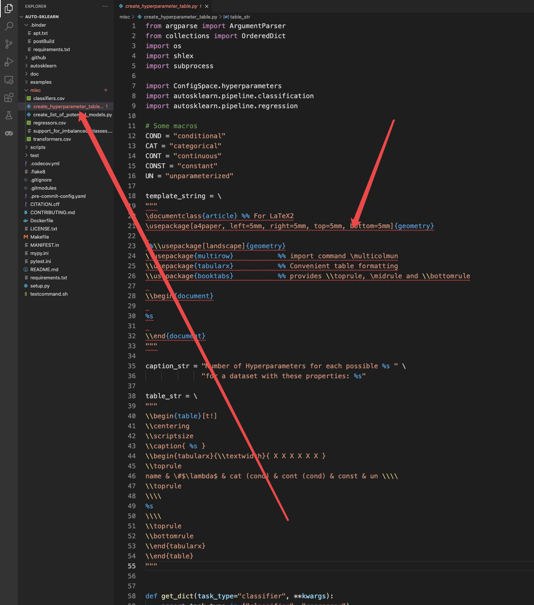
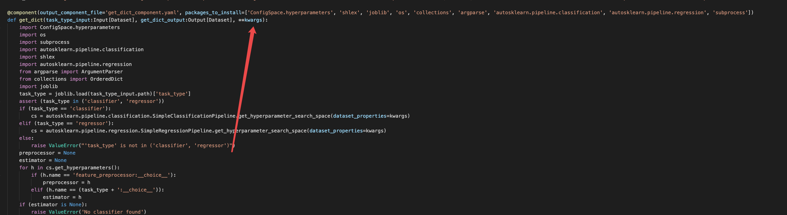
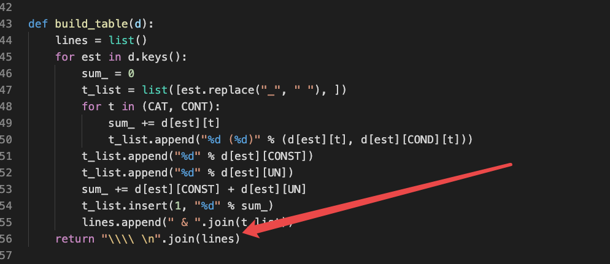
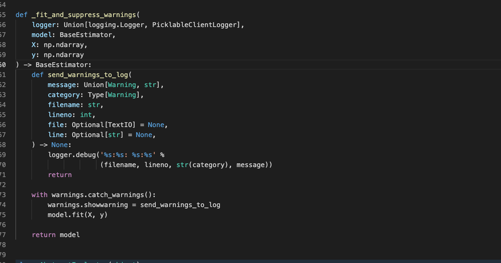
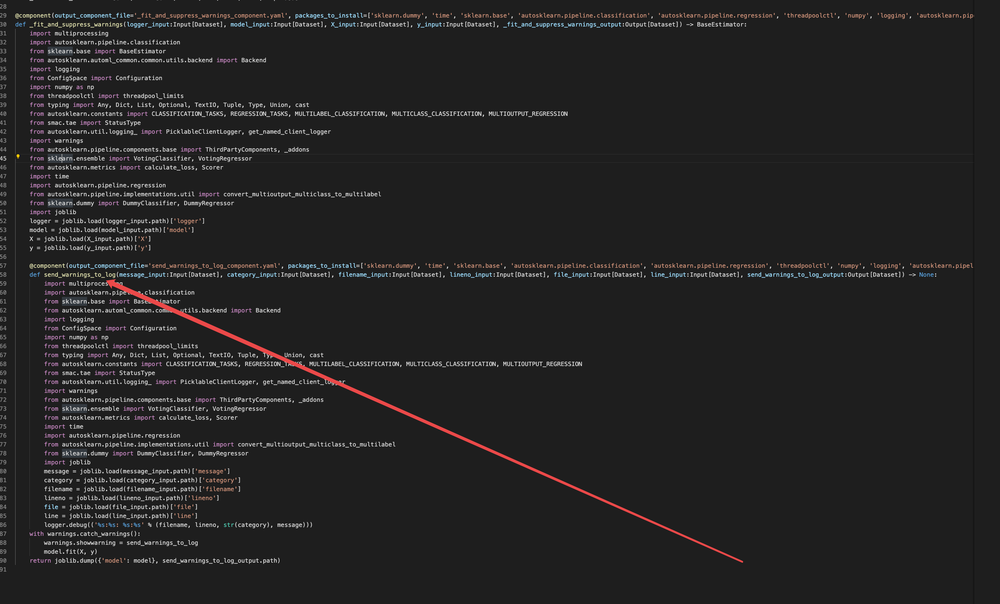
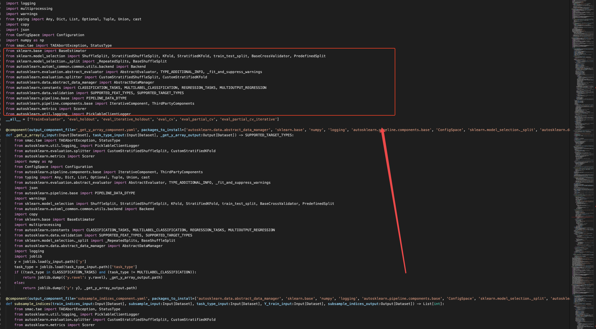
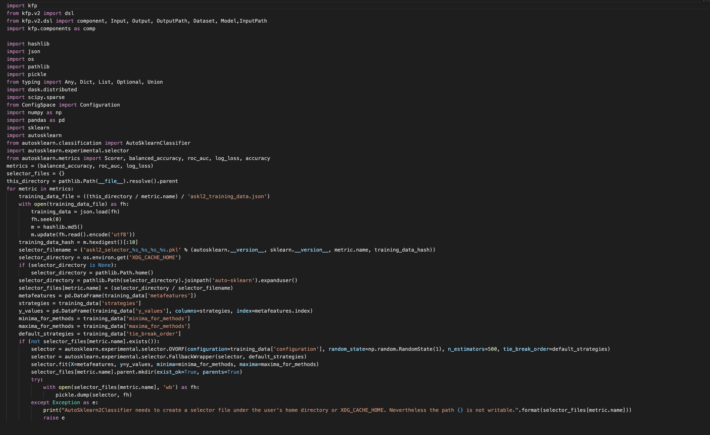

# Sklearn 转换

语法错误 报错

 **kwargs 当形参为 **kwargs的时候会原样显示

当return为方法调用的时候会有报错

不允许有方法里面定义方法的情况出现，如果出现会出现转换错误

import本项目中的东西会当做第三方包的import添加到import上面去（不知道会不会有影响，后面去测试一下）

没有写方法，代码直接写在文件中的这种情况（这种代码应该也不需要去转换）

定义的全局变量这种情况，全局变量将不会起效，因为每一个组件都是单独运行的，不会共享变量

