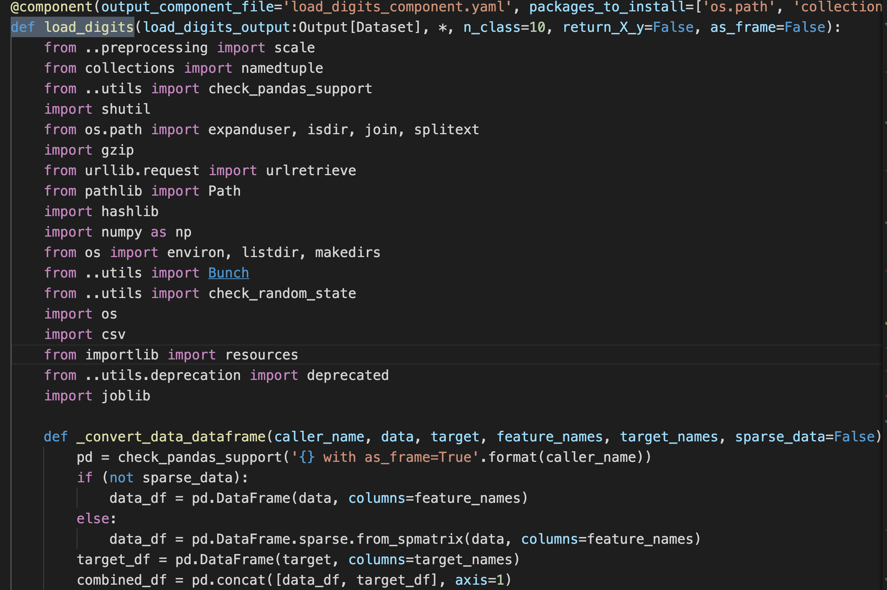
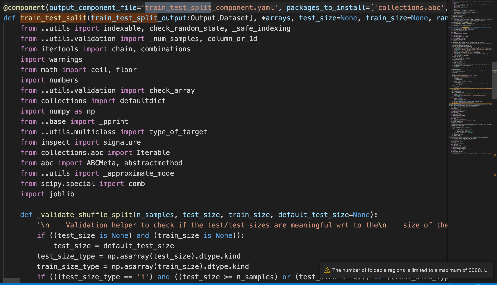
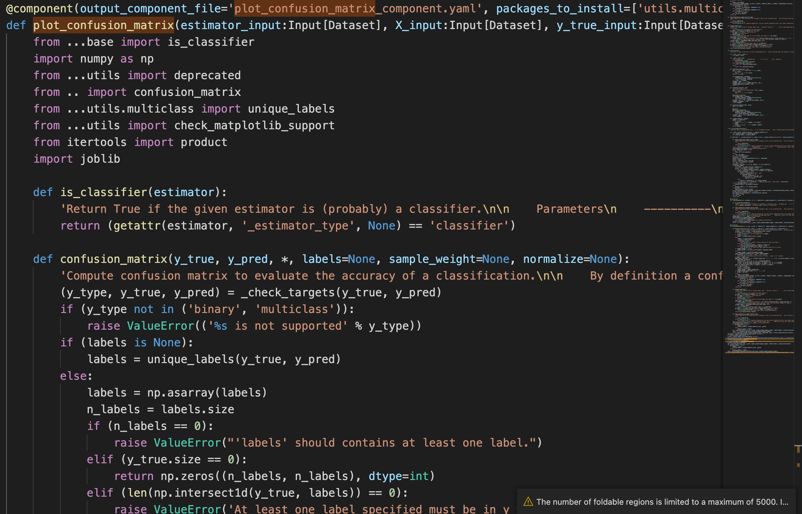

# Skearn Api转换情况

转换的是sklearn源代码

https://scikit-learn.org.cn/view/45.html 用例

| 调用的方法                                                   | 结果截图                                                     | 结果 |
| ------------------------------------------------------------ | ------------------------------------------------------------ | ---- |
| digits = datasets.load_digits()                              |  | ✅    |
| data = digits.images.reshape((n_samples, -1))                | 没找到digits.images.reshape                                  | ❌    |
| classifier = svm.SVC(gamma=0.001)                            | SVC被添加到了需要使用到SVC类的方法中。不支持将一个类转换为一个组件。组件转换的基本单元是方法 | ✅    |
| train_test_split                                             |  | ✅    |
| disp = metrics.plot_confusion_matrix(classifier, X_test, y_test) |  | ✅    |

