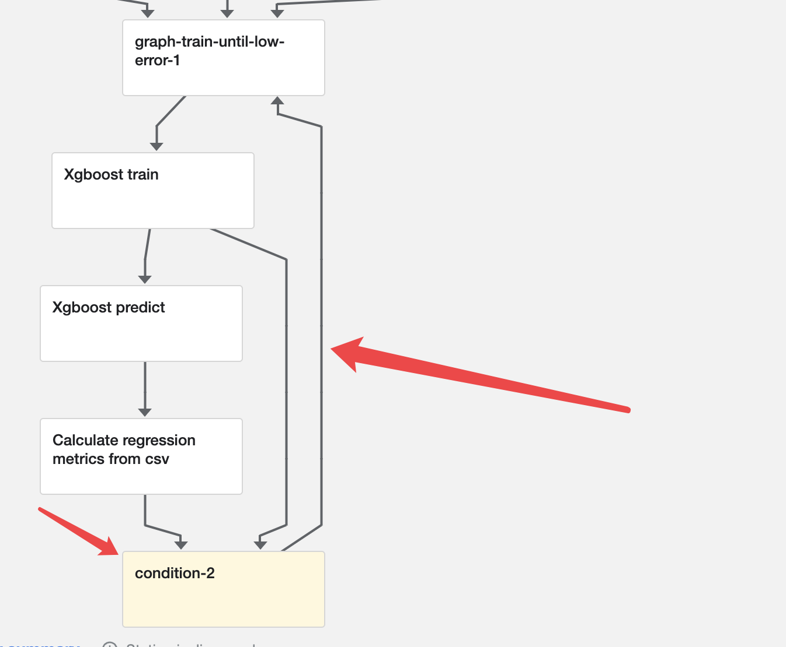

# if和for在pipeline中存在示例

pipeline中可以存在if的关系，如果满足情况才走这条支线或者是才执行这一个组件

官方用法：

```python
def flipcoin_pipeline():
    # 这是一个组件
    flip = flip_coin_op()
    # 这一条语句是条件筛选语句，当满足条件之后才会执行下面的组件
    with dsl.Condition(flip.output == 'heads'):
        random_num_head = get_random_int_op(0, 9)
        with dsl.Condition(random_num_head.output > 5):
            print_op('heads and %s > 5!' % random_num_head.output)
        with dsl.Condition(random_num_head.output <= 5):
            print_op('heads and %s <= 5!' % random_num_head.output
```

## 测试

```python
from kfp.v2 import dsl
from kfp.v2.dsl import component
from kfp.v2.dsl import component, Input, Output, OutputPath, Dataset, Model,InputPath
import kfp.components as comp
import kfp

@component
def iftest() -> str:
    return "pass"

@component
def step2() -> str:
    return "step2"

@component
def step3() -> str:
    return "step3"

@dsl.pipeline(
  name='conditiontest',
  description='An example pipeline that performs handWritten .'
)
def conditiontest():
    contidion_res = iftest()
    # 当返回值是pass的时候才会执行step2
    with dsl.Condition(contidion_res.output == 'pass'):
        step2_res = step2()
    step3()
kfp.compiler.Compiler(mode=kfp.dsl.PipelineExecutionMode.V2_COMPATIBLE).compile(pipeline_func=conditiontest,package_path='conditiontest.yaml')
```

pipeline 图


满足条件执行的情况


不满足情况不执行的情况


for循环

官方示例介绍

This recursive sub-pipeline trains a model, evaluates it, calculates the metrics and checks them.If the model error is too high, then more training is performed until the model is good.

循环使用的是递归的方式来实现的，在最后不满足/满足条件时再调用自己（就类似于循环了），当然就是自己调用自己了，后来发现，这种循环封装的方法是特殊的装饰器修饰的，封装的方法不属于组件而是属于特殊的循环描述（可以理解为子pipeline）。因此组件调用组件的方式还是不可行。

在循环图内不能够存在包安装声明-----组件定义中声明的当前组件需要那些第三方包。因此循环定义的方法中不能有普通的代码，只能够类似于pipeline的使用方式-----只有组件的调用

循环实现案例：

```python
# This recursive sub-pipeline trains a model, evaluates it, calculates the metrics and checks them.
# If the model error is too high, then more training is performed until the model is good.
@kfp.dsl.graph_component # 循环图声明，
def train_until_low_error(starting_model, training_data, true_values):
    # Training
    model = xgboost_train_on_csv_op(
        training_data=training_data,
        starting_model=starting_model,
        label_column=0,
        objective='reg:squarederror',
        num_iterations=50,
    ).outputs['model']

    # Predicting
    predictions = xgboost_predict_on_csv_op(
        data=training_data,
        model=model,
        label_column=0,
    ).output

    # Calculating the regression metrics    
    metrics_task = calculate_regression_metrics_from_csv_op(
        true_values=true_values,
        predicted_values=predictions,
    )

    # Checking the metrics
    with kfp.dsl.Condition(metrics_task.outputs['mean_squared_error'] > 0.01):
        # Training some more
        train_until_low_error(
            starting_model=model,
            training_data=training_data,
            true_values=true_values,
        )
```



