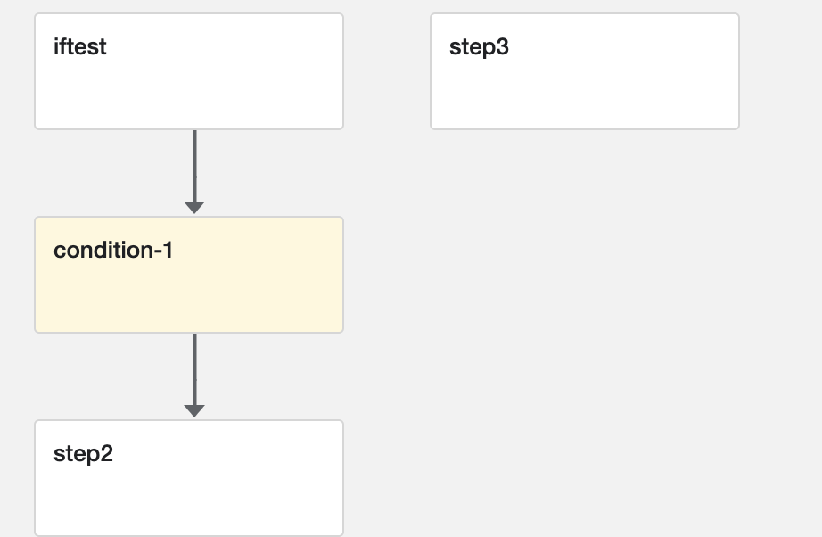
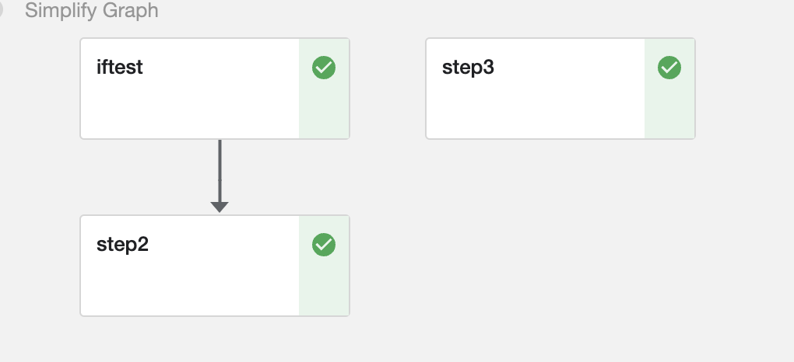
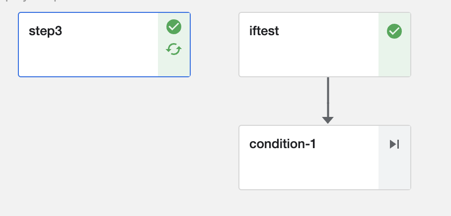

# 

pipeline中可以存在if的关系，如果满足情况才走这条支线或者是才执行这一个组件

官方用法：

```python
def flipcoin_pipeline():
    # 这是一个组件
    flip = flip_coin_op()
    # 这一条语句是条件筛选语句，当满足条件之后才会执行下面的组件
    with dsl.Condition(flip.output == 'heads'):
        random_num_head = get_random_int_op(0, 9)
        with dsl.Condition(random_num_head.output > 5):
            print_op('heads and %s > 5!' % random_num_head.output)
        with dsl.Condition(random_num_head.output <= 5):
            print_op('heads and %s <= 5!' % random_num_head.output
```

## 测试

```python
from kfp.v2 import dsl
from kfp.v2.dsl import component
from kfp.v2.dsl import component, Input, Output, OutputPath, Dataset, Model,InputPath
import kfp.components as comp
import kfp

@component
def iftest() -> str:
    return "pass"

@component
def step2() -> str:
    return "step2"

@component
def step3() -> str:
    return "step3"

@dsl.pipeline(
  name='conditiontest',
  description='An example pipeline that performs handWritten .'
)
def conditiontest():
    contidion_res = iftest()
    # 当返回值是pass的时候才会执行step2
    with dsl.Condition(contidion_res.output == 'pass'):
        step2_res = step2()
    step3()
kfp.compiler.Compiler(mode=kfp.dsl.PipelineExecutionMode.V2_COMPATIBLE).compile(pipeline_func=conditiontest,package_path='conditiontest.yaml')
```

pipeline 图



满足条件执行的情况



不满足情况不执行的情况


