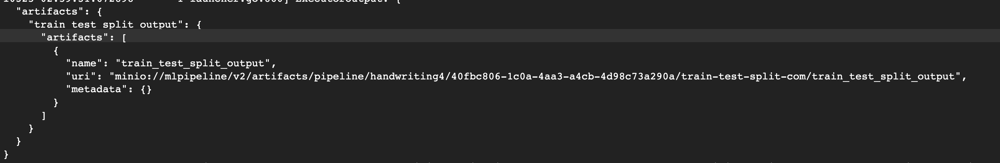

# 集成sklearn手写数字识别

## 方法的嵌套调用问题

方法A在方法体中调用了方法B，方法B的方法体中调用了方法C。但是在代码转换的过程中，检测到方法B并将B的代码添加方法A的方法体中，整个流程到此结束。这个流程会出现一些问题：

+ 没有对方法B进行扫描，因此方法B调用的方法C没有被引入到方法C的方法体内。在运行的时候就会报错

+ 方法B在添加到方法A的方法体中的时候没有将方法B所依赖的包找到并将报引入到方法B的方法体中，因此在实际运行的时候会报错。

	

	解决方法：

	第三方包问题：在第一次扫描方法和类的时候将对应文件的import语句节点保存下来，当需要使用到这些方法的时候将方法引入的同时引入方法依赖的第三方包

	方法中引用方法问题：目前是采用在转换遍历之前先扫描所有的方法，将所有的方法保存下来。再从头扫描每一个方法，检查每一个方法所调用的方法，并将这些方法先引入到方法列表中来。
	
	​	使用这个方法会出现的问题：
	
	​		方法A调用了方法B，方法B调用了方法C，方法ABC的原始方法定义节点都在方法列表里，现在我们对方法进行扫描
	
	

包引入问题：

​	

## 关于源码转换的思考

​	对源码进行转换还是对源码API的调用进行转换？那种转换方式更加合理？

   将方法转换为组件其目的是对外提供组件的调用，将以前调用方法的形式转变成为对组件的调用，而不是对组件源码进行组件化。在调用sklearn中某一个API的时候并不会关心这个API内部的源码是如何构成的。我们目前所做的工作是获取sklearn的源码，将源码里面的每一个方法都转换成为一个组件，但是有些方法并不会对外提供功能，他只是对sklearn内部提供作用。因此这类方法的转换将是无用功，并且对sklearn包中对外提供功能的那部分API方法进行转换的时候需要将这个方法需要依赖的方法都搬到当前方法中提高了整个组件的复杂度。

​		提出一种解决方式：在sklearn api的基础之上进行一层API调用的方法封装，封装好之后对封装的方法进行组件化。这样写的话就不会触碰到sklearn的源码，因此方法调用就可以直接引入sklearn包，sklearn中类的使用也可以直接解决。这种方式的坏处就是需要投入较大的工作量去对框架API 进行再封装。

单个组件运行的日志，根据日志显示可以知道，元数据是统一存的

