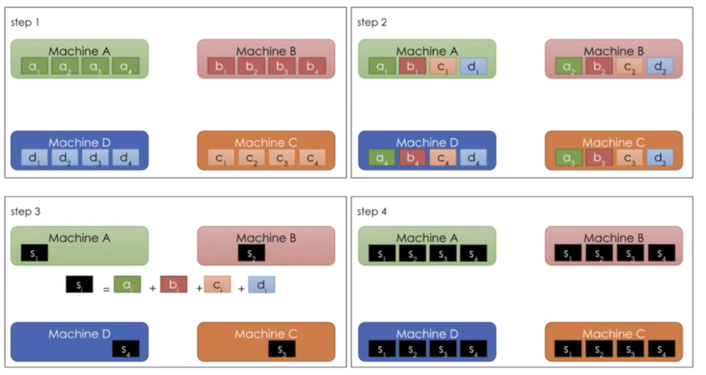

# Kuebeflow 相关问题

## Kubeflow 相关资料

[IDM介绍Kubeflow的PPT](https://www.slideshare.net/AnimeshSingh/kubeflow-pipelines-with-tekton-236769976)

## 分布式模型训练

[Kubeflow系列讲座之六《分布式训练和 AutoML》](https://www.bilibili.com/video/BV19Z4y13788?vd_source=8139ca316b311fcea2263716b9b68a47)

在Kubeflow上分布式训练有两种方式：

第一种：Parameter Servers （主要是Tensorflow在用）

选择一个主节点A，BCD三个节点都是从节点，BCD分别计算好自己的参数之后，将参数发送到A节点中，A整合参数之后再将整合后的参数分别发送到BCD节点中。

第二种： AllReduce （主要是Pytorch在用）

 这种方法有四个节点ABCD，每一个节点都拿到全部的参数，但是每一个节点都只计算自己负责的那一部分，计算好之后将自己的计算结果分别传送到其他机器上

## Kubeflow Pipeline共享数据空间问题

Kubeflow Pipeline 是使用Kubeflow Pipeline SDK构建的可重用的端到端的ML工作流

[Pipeline repositories ](https://github.com/kubeflow/pipelines)

[PytorchJob](https://www.kubeflow.org/docs/components/training/pytorch/)

https://cloud.google.com/blog/products/ai-machine-learning/getting-started-kubeflow-pipelines

