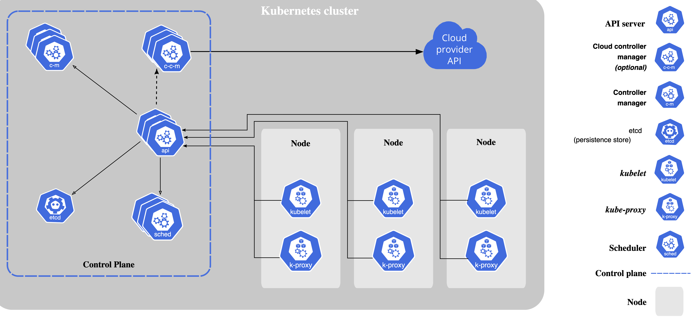

# Kubernetes

[k8s文档](https://kubernetes.io/zh-cn/docs/home/)

## 谷歌对 Kubernetes的定位目标——自动化、智能化

## K8s架构图

### kube-apiserver

​	 API主要是向外提供集群管理的REST API接口，包括认证授权、数据校验以及集群状态变更等。换句话说就是集群操作的接口和与其他模块通信的接口。

> API 服务器是 Kubernetes [控制平面](https://kubernetes.io/zh-cn/docs/reference/glossary/?all=true#term-control-plane)的组件， 该组件负责公开了 Kubernetes API，负责处理接受请求的工作。 API 服务器是 Kubernetes 控制平面的前端。`kube-apiserver` 设计上考虑了水平扩缩，也就是说，它可通过部署多个实例来进行扩缩。

### etcd

etcd本身是一个高可用的kv存储数据库，主要用于共享配置和服务发现。

在k8s中，etcd用于保存集群所有的网络配置和对象的状态信息

> `etcd` 是兼顾一致性与高可用性的键值数据库，可以作为保存 Kubernetes 所有集群数据的后台数据库。
>
> 分布式、可靠的键值存储，用于存储分布式系统中最关键的数据 [etcd](https://etcd.io)

### kube-scheduler

负责pods的调度。

​	详细的说就是，kube-scheduler会监测新创建并且还没有被调度到Node上的Pod，找到之后将它调度到指定的Node上来运行。

具体的调度过程：

>  `kube-scheduler` 是[控制平面](https://kubernetes.io/zh-cn/docs/reference/glossary/?all=true#term-control-plane)的组件， 负责监视新创建的、未指定运行节点（node）的 Pods， 并选择节点来让 Pod 在上面运行。调度决策考虑的因素包括单个 Pod 及 Pods 集合的资源需求、软硬件及策略约束、 亲和性及反亲和性规范、数据位置、工作负载间的干扰及最后时限。

> 控制平面是指：容器编排层，它暴露API和接口来定义、部署容器和管理容器的生命周期
>
> kube-scheduler：我认为是对节点的调度器

### kube-controller-manager

管理和控制整个集群,主要对资源对象进行管理,当Node节点中运行的POD对象或是Node自身发生故障时,Controller Manager会及时发现并处理，以确保整个集群处于理想工作状态.

在k8s中，k8s资源对象会有两个状态，一个是**期望状态** 、一个是**当前状态**，对应资源的控制器负责确保资源的当前状态接近期望状态。

在k8s中，控制器通过监控集群的公共状态，并致力于将当前状态转变为期望状态。

>  [kube-controller-manager](https://kubernetes.io/zh-cn/docs/reference/command-line-tools-reference/kube-controller-manager/) 是[控制平面](https://kubernetes.io/zh-cn/docs/reference/glossary/?all=true#term-control-plane)的组件， 负责运行[控制器](https://kubernetes.io/zh-cn/docs/concepts/architecture/controller/)进程。从逻辑上讲， 每个[控制器](https://kubernetes.io/zh-cn/docs/concepts/architecture/controller/)都是一个单独的进程， 但是为了降低复杂性，它们都被编译到同一个可执行文件，并在同一个进程中运行。
>
> 这些控制器包括：
>
> - 节点控制器（Node Controller）：负责在节点出现故障时进行通知和响应
> - 任务控制器（Job Controller）：监测代表一次性任务的 Job 对象，然后创建 Pods 来运行这些任务直至完成
> - 端点控制器（Endpoints Controller）：填充端点（Endpoints）对象（即加入 Service 与 Pod）
> - 服务帐户和令牌控制器（Service Account & Token Controllers）：为新的命名空间创建默认帐户和 API 访问令牌

> Kubernetes 控制器管理器是一个守护进程，内嵌随 Kubernetes 一起发布的核心控制回路。 在机器人和自动化的应用中，控制回路是一个永不休止的循环，用于调节系统状态。 在 Kubernetes 中，每个控制器是一个控制回路，通过 API 服务器监视集群的共享状态， 并尝试进行更改以将当前状态转为期望状态。 目前，Kubernetes 自带的控制器例子包括副本控制器、节点控制器、命名空间控制器和服务账号控制器等。

### cloud-controller-manager

`cloud-controller-manager` 是指嵌入特定云的控制逻辑之 [控制平面](https://kubernetes.io/zh-cn/docs/reference/glossary/?all=true#term-control-plane)组件。 `cloud-controller-manager` 允许你将你的集群连接到云提供商的 API 之上， 并将与该云平台交互的组件同与你的集群交互的组件分离开来。

`cloud-controller-manager` 仅运行特定于云平台的控制器。 因此如果你在自己的环境中运行 Kubernetes，或者在本地计算机中运行学习环境， 所部署的集群不需要有云控制器管理器。

与 `kube-controller-manager` 类似，`cloud-controller-manager` 将若干逻辑上独立的控制回路组合到同一个可执行文件中， 供你以同一进程的方式运行。 你可以对其执行水平扩容（运行不止一个副本）以提升性能或者增强容错能力。

下面的控制器都包含对云平台驱动的依赖：

- 节点控制器（Node Controller）：用于在节点终止响应后检查云提供商以确定节点是否已被删除
- 路由控制器（Route Controller）：用于在底层云基础架构中设置路由
- 服务控制器（Service Controller）：用于创建、更新和删除云提供商负载均衡器

### kubelet

kubelet的主要作用是：

+ pod管理，运行pod等
+ 容器健康检查：容器运行之后，需要对容器健康状态进行检查，如果处于不健康状态则需要按照特定的策略进行处理。
+ 容器监控：监控所在节点的资源使用情况并定时向master报告

`kubelet` 会在集群中每个[节点（node）](https://kubernetes.io/zh-cn/docs/concepts/architecture/nodes/)上运行。 它保证[容器（containers）](https://kubernetes.io/zh-cn/docs/concepts/overview/what-is-kubernetes/#why-containers)都运行在 [Pod](https://kubernetes.io/docs/concepts/workloads/pods/pod-overview/) 中。

kubelet 接收一组通过各类机制提供给它的 PodSpecs， 确保这些 PodSpecs 中描述的容器处于运行状态且健康。 kubelet 不会管理不是由 Kubernetes 创建的容器。

### kube-proxy

[kube-proxy](https://kubernetes.io/zh-cn/docs/reference/command-line-tools-reference/kube-proxy/) 是集群中每个[节点（node）](https://kubernetes.io/zh-cn/docs/concepts/architecture/nodes/)所上运行的网络代理， 实现 Kubernetes [服务（Service）](https://kubernetes.io/zh-cn/docs/concepts/services-networking/service/) 概念的一部分。

kube-proxy 维护节点上的一些网络规则， 这些网络规则会允许从集群内部或外部的网络会话与 Pod 进行网络通信。

如果操作系统提供了可用的数据包过滤层，则 kube-proxy 会通过它来实现网络规则。 否则，kube-proxy 仅做流量转发。

