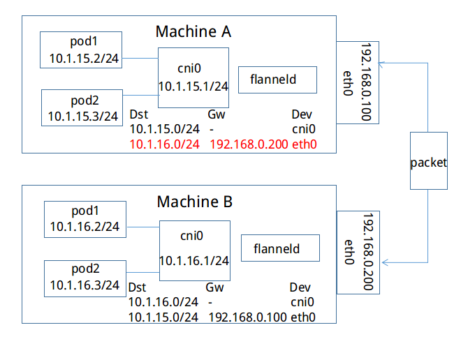
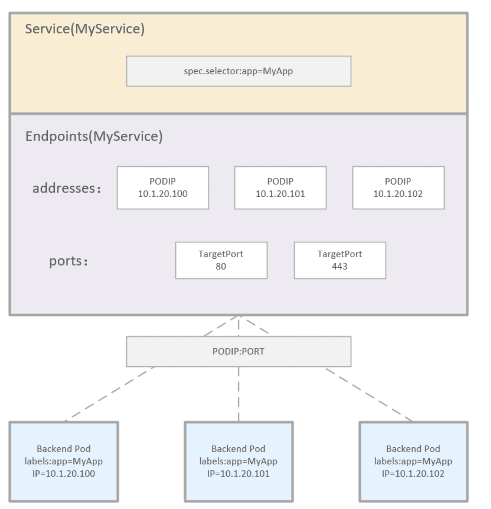
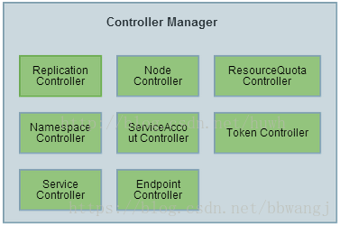

# K8s架构中的一些其他组件

## kubelet

每个Node节点上都运行一个 Kubelet 服务进程，默认监听 10250 端口，接收并执行 Master 发来的指令，管理 Pod 及 Pod 中的容器。每个 Kubelet 进程会在 API Server 上注册所在Node节点的信息，定期向 Master 节点汇报该节点的资源使用情况，并通过 cAdvisor 监控节点和容器的资源。

## Kubernetes [网络模型](https://kubernetes.io/zh-cn/docs/concepts/services-networking/)

集群中的每个pod都会有自己的独立IP，这样就不需要显式的在pod之间创建连接，pod可以被视作虚拟机或者物理主机。pod之间可以直接通信， 且不需要网络地址转译。

要实现这个网络模型便需要一个容器网络接口[CNI](https://github.com/containernetworking/cni)插件，

## flannel

 

## kube-scheduler 调度

调度的作用主要是将pod分配到一个合适的节点。以便于k8s能够运行他们。

在做调度决定时需要考虑的因素包括：单独和整体的资源请求、硬件/软件/策略限制、 亲和以及反亲和要求、数据局域性、负载间的干扰等等

几个名词解释：

+ 抢占 (Preemption) ：终止低优先级的Pod，以便于高优先级的Pod的能够运行。
+ 驱逐 (Eviction) ：在资源匮乏的节点上，主动让一个或多个Pod失效的过程。

kube-scheduler 给一个 pod 做调度选择包含两个步骤：

+ 过滤
+ 打分

过滤阶段会将所有满足 Pod 调度需求的 Node **过滤**出来，在过滤之后，得出一个 Node 列表（放在优先级队列里面），里面包含了所有可调度节点；如果这个列表为空则表示这个pod不可调度。如果这个列表不为空，则将会对列表内的Node进行**打分**，最后将Pod调度到得分最高的Node上，如果得分最高的Node不止一个那么就随机选择一个。

## Service

Service 是对一组提供相同功能的 Pods 的抽象，并为它们提供一个统一的入口。借助 Service，应用可以方便的实现服务发现与负载均衡，并实现应用的零宕机升级。Service 通过标签来选取服务后端，这些匹配标签的 Pod IP 和端口列表组成 endpoints，由 kube-proxy 负责将服务 IP 负载均衡到这些 endpoints 上。

##  Endpoints

是一组实际服务的端点集合。一个 Endpoint 是一个可被访问的服务端点，即一个状态为 running 的 pod 的可访问端点。一般 Pod 都不是一个独立存在，所以一组 Pod 的端点合在一起称为 EndPoints。只有被 Service Selector 匹配选中并且状态为 Running 的才会被加入到和 Service 同名的 Endpoints 中。

service、endpoints和pod的关系如下图所示

## 控制器 kube-controller-manager

Controller Manager作为集群内部的管理控制中心，负责集群内的Node、Pod副本、服务端点（Endpoint）、命名空间（Namespace）、服务账号（ServiceAccount）、资源定额（ResourceQuota）的管理，当某个Node意外宕机时，Controller Manager会及时发现并执行自动化修复流程，确保集群始终处于预期的工作状态。 

每个Controller通过API Server提供的接口实时监控整个集群的每个资源对象的当前状态，当发生各种故障导致系统状态发生变化时，会尝试将系统状态修复到“期望状态”。

+ Replication Controller（副本控制器）：副本控制器的作用即保证集群中一个RC所关联的Pod副本数始终保持预设值。

	+ 使用场景：当发生节点故障或Pod被意外终止运行时，可以重新调度保证集群中仍然运行指定的副本数。 
	+ 弹性伸缩 通过手动或自动扩容代理修复副本控制器的spec.replicas属性，可以实现弹性伸缩。 kubectl scale 
	+ 滚动更新 创建一个新的RC文件，通过kubectl 命令或API执行，则会新增一个新的副本同时删除旧的副本，当旧副本为0时，删除旧的RC。 kubectl rolling-update

+ Node Controller (节点控制器):Node Controller通过API Server实时获取Node的相关信息，实现管理和监控集群中的各个Node节点的相关控制功能。

+ ResourceQuota Controller:资源配额管理确保指定的资源对象在任何时候都不会超量占用系统物理资源。 

	+ 支持对三个级别的资源进行管理：

		+ 容器级别：对CPU和Memory进行限制

		+ Pod级别：对一个Pod内所有容器的可用资源进行限制

		+ Namespace级别：包括：

			  a.Pod数量 
			  b.Replication Controller数量 
			  c.Service 数量 
			  d.ResourceQuota数量 
			  e.Secret数量 
			  f.PV 数量 

+ Namespace Controller：用户通过API Server可以创建新的Namespace并保存在etcd中，Namespace Controller定时通过API Server读取这些Namespace信息。如果Namespace被API标记为优雅删除（即设置删除期限，DeletionTimestamp）,则将该Namespace状态设置为“Terminating”,并保存到etcd中。同时Namespace Controller删除该Namespace下的ServiceAccount、RC、Pod等资源对象。

+ Endpoint Controller：endpoints controller是kube-controller-manager组件中众多控制器中的一个，是 endpoints 资源对象的控制器，其通过对service、pod 2种资源的监听，当这2种资源发生变化时会触发 endpoints controller 对相应的endpoints资源进行调谐操作，从而完成endpoints对象的新建、更新、删除等操作。

+ Service Controller：Service Controller是属于kubernetes集群与外部的云平台之间的一个接口控制器。Service Controller监听Service变化，如果是一个LoadBalancer类型的Service，则确保外部的云平台上对该Service对应的LoadBalancer实例被相应地创建、删除及更新路由转发表。

