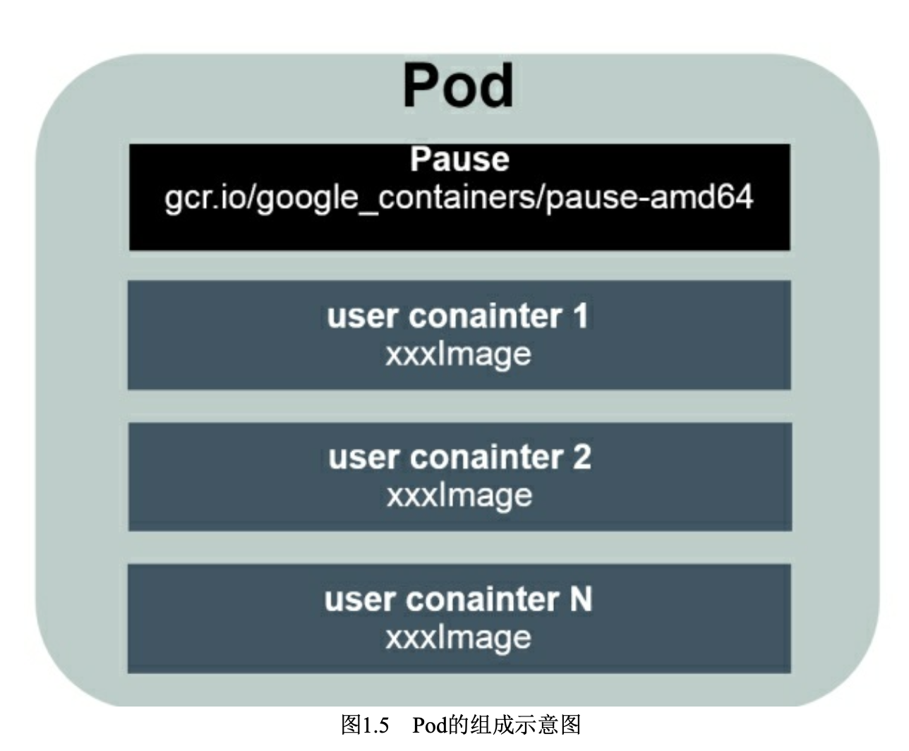

# 相关知识

## 什么是云原生？

[官方解答](https://tanzu.vmware.com/cn/cloud-native)

云原生是一种方法，用于构建和运行充分利用云计算模型优势的应用。云计算不再将重点放在资本投资和员工上来运行企业数据中心，而是提供无限制的按需计算能力和根据使用情况付费的功能，从而重新定义了几乎所有行业的竞争格局。IT 开销减少意味着入行的壁垒更低，这一竞争优势使得各团队可以快速将新想法推向市场，这就是软件正在占据世界，并且初创公司正在使用云原生方法来颠覆传统行业的原因。

但是，企业需要一个用于构建和运行云原生应用和服务的平台，来自动执行并集成 DevOps、持续交付、微服务和容器等概念

## 什么是 CI/CD ？

[What is CI/CD?](https://tanzu.vmware.com/cn/cicd)

CI/CD 的核心概念是**持续集成、持续交付和持续部署**。CI/CD 可让持续自动化和持续监控贯穿于应用的整个生命周期（从集成和测试阶段，到交付和部署）。

**Continuous integration (CI)**:CI是将代码提交到共享存储库之后执行自动构建和测试软件的过程，它可以验证软件的功能，预先识别错误，并防止以后浪费周期。

**Continuous delivery (CD)** ：CD是将在CI过程中创建的应用程序交付到类似生产的环境中的过程，在该环境中对这些应用程序进行额外的自动化测试，以确保每个应用程序在推送到生产环境中并交到实际用户手中时都能按预期运行。CD还确保最新版本与其他软件和应用程序按预期进行交互。

## Pause容器？

主要作用：创建共享的网络名称空间，以便于其它容器以平等的关系加入此网络名称空间

pause进程是pod中所有容器的父进程（即第一个进程）；

为什么Kubernetes会设计出一个全新的Pod概念并且Pod有这样特殊

的组成结构?原因如下。

◎ 为多进程之间的协作提供一个抽象模型，使用Pod作为基本的 调度、复制等管理工作的最小单位，让多个应用进程能一起有效地调度 和伸缩。

◎ Pod里的多个业务容器共享Pause容器的IP，共享Pause容器挂接 的V olume，这样既简化了密切关联的业务容器之间的通信问题，也很 好地解决了它们之间的文件共享问题。

## 有状态和无状态之间的区别

无状态服务不会在本地存储持久化数据.多个服务实例对于同一个用户请求的响应结果是完全一致的.这种多服务实例之间是没有依赖关系,比如web应用,在k8s控制器 中动态启停无状态服务的pod并不会对其它的pod产生影响.

有状态服务需要在本地存储持久化数据,典型的是分布式数据库的应用,分布式节点实例之间有依赖的拓扑关系.比如,主从关系. 如果K8S停止分布式集群中任 一实例pod,就可能会导致数据丢失或者集群的crash.

总结下来，在有状态集群中一般有如下特殊共 性。

◎ 每个节点都有固定的身份ID，通过这个ID，集群中的成员可以 相互发现并通信。

◎ 集群的规模是比较固定的，集群规模不能随意变动。
◎ 集群中的每个节点都是有状态的，通常会持久化数据到永久存
储中，每个节点在重启后都需要使用原有的持久化数据。
◎ 集群中成员节点的启动顺序(以及关闭顺序)通常也是确定
的。
◎ 如果磁盘损坏，则集群里的某个节点无法正常运行，集群功能
受损。

## K8s三种应用建模的资源对象，总结如下。

◎ 无状态服务的建模:Deployment。

◎ 有状态集群的建模:StatefulSet。

◎ 批处理应用的建模:Job。

## RBAC(Role-Based Access Control)

Kubernetes进一步实现和完善了基于角色的访问控制权限系统