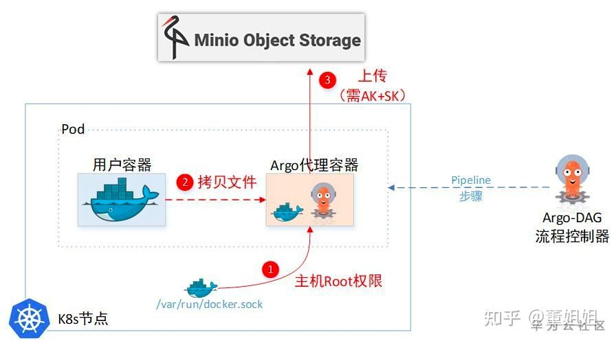

# kubeflow数据传输问题

Kubeflow Pipeline底层其实是基于流程引擎Argo做了一层封装。也就是kubeflow pipeline的调度是由argo完成的。

在实际运行的时候，一个component就是一个pod。在kubernetes分布式环境下，不同的pod会被调度到不同的node上。在模型训练这个大数据量的场景里，跨服务器的数据通信的效率十分重要。

[KubeFlow-Pipeline及Argo实现原理速析](https://bbs.huaweicloud.com/blogs/172101)

## Argo 数据传递

Argo数据传递由两种情况：传递参数和传递文件

### 传递参数

当pod之间需要传递参数时，operator会从前一个pod中查询到信息，在第二个pod启动时将参数注入到yaml的指定字段（annotation）内。由于yaml是用k8s [etcd](https://etcd.io)作为存储，因此这种传输方式对数据大小有限制，每个参数要满足etcd max-request-bytes的限制，默认是1.5M，而etcd最大支持存储8G的数据。这就意味着我们不可能通过这种方式传太大的数据，只能用来传输一些超参数。

> etcd
>
>  A distributed, reliable key-value store for the most critical data of a distributed system(分布式、可靠的键值存储，用于存储分布式系统中最关键的数据)
>
> 当etcd用咋k8s中的时候，主要是用于保存集群所有的网络配置和对象的状态信息。
>
> [etcd具体的东西](https://matthewpalmer.net/kubernetes-app-developer/articles/how-does-kubernetes-use-etcd.html)

### 传递文件

当pod之间需要传输文件时，operator在启动component时不仅会启动用户容器，还会启动一个用来复制数据的sidecar容器。这个sidecar会在用户容器执行结束时从其中拷贝结果文件，通过s3协议上传到跟argo一起部署的一个[minio](http://www.minio.org.cn)里。在下一个component启动时，sidecar再从minio把文件下载下来。

> minio 是一个对象存储服务器

这个方案的问题在于，在模型训练场景里，每个component的output非常大，如果在每个component里都要上传下载，是很浪费时间的做法。

由于argo原生的两种数据传递方式对模型训练场景并不是很友好，目前也没有太好的解决方案，我们现在的做法是通过挂载一个ReadWriteMany的分布式文件存储系统来实现的。

**已经提出的一些方法：**

+ argo官方仓库的一个ISSUE：提议将需要传递参数的两个pod挂载在共享存储下。[链接](https://github.com/argoproj/argo-workflows/issues/1349)

	+ 这种方法如果pod不在同一台机器上就无法挂载
	+ 
	
	