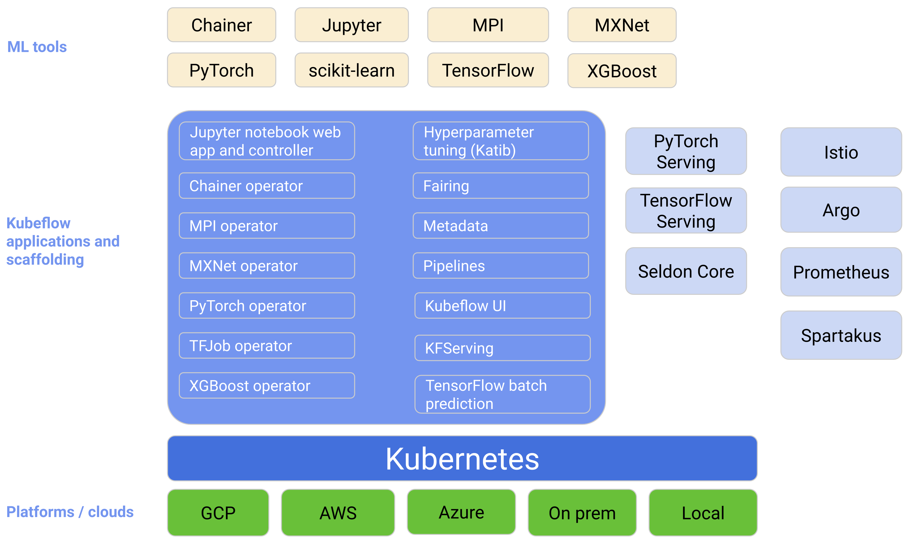

# Kubeflow

## Kubeflow的目标

kubeflow的目标是通过让Kubernetes做它擅长的事情，使扩展机器学习(ML)模型并将它们部署到生产中尽可能简单：

+ 在各种基础设施上轻松、可重复、便携地部署(例如，在笔记本电脑上进行试验，然后迁移到本地群集或云)
+ 部署和管理松散耦合的微服务
+ 根据需求进行扩展





### Kubeflow 特点

在不同的基础设施上进行简单、可重复、可移植的部署(例如，在笔记本电脑上进行试验，然后转移到内部集群或云)

部署和管理松散耦合的微服务

可以在有k8s的地方轻松的使用ML技术栈

可以快速将机器学习搬到云平台上来


kubeflow的各种组件提供了API和SDK

## kubeflow的组件

+ dashboard 展示kubeflow的管理页面

+ notebook 

	+ 能够支持在线jupyter、vscode、R studio。
	+ 用户可以直接在集群中创建笔记本容器，而不必在本地工作站上创建。
	+ 管理员可以提供预安装了软件包的jupyter镜像
	+ 访问控制管理使用的是Kubeflow的RBAC，整个组织之间可以更加容易的共享notebook
	+ [jupyter 带有cuda的镜像选择地址](https://www.kubeflow.org/docs/components/notebooks/container-images/)
	+ 

+ Pipeline:

	+ pipeline主要是实现以下目标

		+ 机器学习工作流端到端的编排
		+ 通过可充用组件和管道实现pipeline的可组合性
		+ 可以轻松管理、跟踪和可视化pipeline的定义、运行、实验和ML构件
		+ 通过缓存消除冗余执行来有效利用计算资源

	+ 两个组件之间可以是互相依赖的也可以是互相没有依赖的，如果一个任务的输出并不是另一个任务的输入，并且两个任务是互相独立的，那么这两个任务在pipeline运行时是可以并发执行的。[数据传递的方式](https://www.kubeflow.org/docs/components/pipelines/v2/author-a-pipeline/tasks/)

		```python 
		from kfp import dsl
		
		@dsl.pipeline()
		def my_pipeline():
		    my_task1 = concat_comp(prefix='hello, ', text='world')
		    my_task2 = concat_comp(prefix='hi, ', text='universe')
		```

	+ 组件输入输出类型

	+ [组件编写的规则](https://www.kubeflow.org/docs/components/pipelines/v2/author-a-pipeline/pipelines/#dslcondition)

+  Katib  用于超参数调优和神经网络结构搜索

+ istio  Kubeflow 使用 Istio 作为保护、连接和监视微服务的统一方法。

+ Fairing。 在混合云中构件ML工作流

+ 

+ 

	

	

	

	

	

	