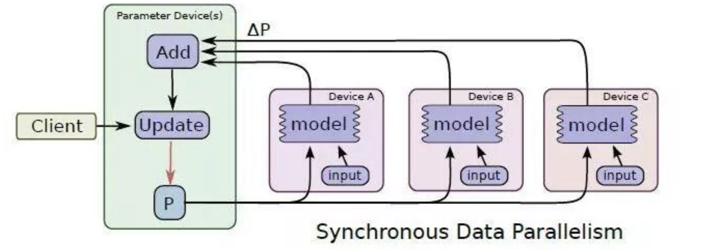
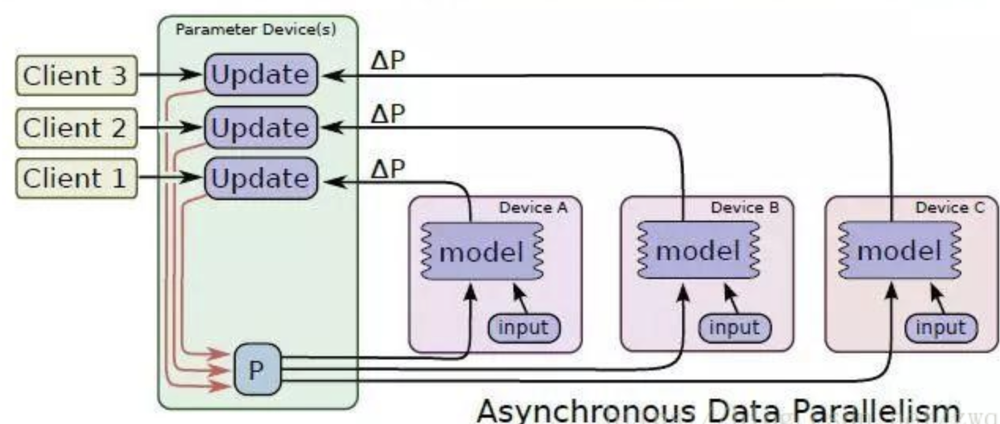

# 分布式训练

## 并行策略

有两种深度学习模型并行的方式：

1. 模型并行
2. 数据并行

### 模型并行ModelParallel

模型并行性是指将模型逻辑上分成若干部分（即，一部分中的一些层，另一部分中的一些部分），然后将它们放置在不同的硬件/设备上。 虽然将部件放置在不同的设备上确实在执行时间方面具有优势（数据的异步处理），但是通常采用它来避免存储器约束。 具有大量参数的模型由于高内存占用而难以适合单个系统，因此受益于此类策略。

模型并行垂直拆分，需要将每一层中的计算和参数划分到多个设备上，这需要在每一层之间进行大量的通信。

### 数据并行 DataParallel

数据并行相对简单， N个node(也称为worker)构成一个分布式集群，每个worker处理1/N的数据。数据并行是在每个worker上存储一个模型的备份，在各个worker 上处理不同的数据子集。然后需要规约(reduce)每个worker的结果，在各节点之间同步模型参数。这一步会成为数据并行的瓶颈，因为如果worker很多的情况下，worker之间的数据传输会有很大的时间成本。

​	数据并行在pytorch内又分为**数据并行**和**分布式数据并行**，pytorch推荐使用分布式数据并行 [torch官方文档](https://pytorch.org/docs/stable/notes/cuda.html#cuda-nn-ddp-instead)

​	在数据并行中，数据并行还可以分为两类：

+ 同步并行：

	

	+ 做法：所谓同步并行就是指所有的设备都采用相同的模型参数来训练，等待所有设备的mini-batch都训练完以后，收集他们的梯度然后取均值，然后执行模型的一次参数更新，这相当于通过聚合很多设备上的mini-batch形成一个很大的batch来训练模型。
	+ 缺点：需要每一个设备的算力均衡，并且集群的通信也要均衡，如果有一个设备的算力或者是通信不均衡的话就会让其他设备等待，从而拖慢整个训练的时间
	+ 优点：不会出现梯度失效问题

+ 异步并行

	

	+ 做法：异步训练中，各个设备完成一个mini-batch训练之后，不需要等待其它节点，直接去更新模型的参数，这样总体会训练速度会快很多。
	
		在传统的Asynchronous Stochastic Gradient Descent（ASGD）中，采用的是master-worker架构，每一个worker不断地从master中拉取最新的模型，从共享的数据集中提取小批量的样本计算梯度，然后把他们推回到master中，然后master用这个梯度更新全局模型。
	
	+ 缺点：刚开始所有设备采用相同的参数来训练，但是异步情况下，某个设备完成一步训练后，可能发现模型参数其实已经被其它设备更新过了，此时这个梯度就过期了，因为现在的模型参数和训练前采用的参数是不一样的。由于梯度失效问题，异步训练虽然速度快，但是可能陷入次优解（sub-optimal training performance）。
	
		+ 为了解决这个问题，很多人是提出了在异步环境中使用的梯度下降算法。如Asynchronous Stochastic Gradient Descent over Decentralized Datasets中提出了ASGD
	
	+ 优点：由于异步算法没有空闲时间，可以充分利用计算资源，具有很高的灵活性。

### DP & MP

DP具有良好的计算/通信效率，但存储效率极低，MP的计算/通信效率较低

更具体地说，DP 在所有数据并行处理过程中复制整个模型状态，导致冗余内存消耗; 而 MP 对这些状态进行划分以获得高内存效率，但往往会导致过细粒度的计算和昂贵的通信，从而降低缩放效率。

目前Pytorch分布式训练采取的是AllReduce的方式，首先分将batch分为n部分，每一个节点计算一部分，计算完成之后将参数传回到master节点，master节点进行梯度更新之后，再将参数传递给其他的worker节点。

### AllReduce

AllReduce是一类算法，目标是高效得将不同机器中的数据整合（reduce）之后再把结果分发给各个机器。

### Ring AllReduce

采用环的形式去解决数据传输的问题

## 现有模型训练内存占用原因

+ 对于大型模型，大部分内存被优化器状态、梯度和参数。
+ 剩余的部分被activation、临时缓冲区和不可用的碎片内存消耗
