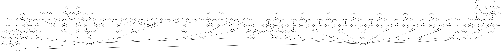

# AST样例

使用代码为：

```python
import requests
import numpy as np
import pandas as pd


def load_data(url, filename: str, url1: int = 10) -> (int, int):
    f = requests.get(url)
    with open(filename, 'wb') as code:
        code.write(f.content)
    a = pd.read_excel(filename)
    xdata = a[['t', 'X_t_1', 'X_t_2', 't_T_1_X_t_1', 't_T_2_X_t_2', 'H_t', 'ck1', 'sk1', 'ck2', 'sk2']]
    ydata = np.log(a["Y"])
    return xdata, ydata


def get_model1(xdata, ydata):
    params = Parameters()
    params.add('beta0', value=1.)
    params.add('beta1', value=1.)
    params.add('beta6', value=1.)
    params.add('ck1', value=1.)
    params.add('sk1', value=1.)
    params.add('ck2', value=1.)
    params.add('sk2', value=1.)
    load_data()
    model = minimize(load_data(), params, args=(xdata.values, ydata.values))
    # return joblib.dump({"model":model},output_path.path)
    return model
```

使用当前代码包括了大多数的用例，如方法参数、返回值、方法调用等。能够满足正常的代码需求。

## 转换方法

```txt
处理方法代码
    将需要引入的kubeflow SDK的import代码添加到文件上面
    ✅将import代码添加到方法定义语句的下一行,包括joblib包的添加
    ✅将方法参数修改为元数据形式并添加输出元数据
    ❓删除方法返回type  暂时没有找到方法返回类型声明对应的node节点  找到了 对象是returns  返回值是Return
    ✅还原参数变量  使用joblib还原参数到原来的样式
    ✅在方法定义的上面一行添加装饰器 
    ✅修改方法返回值 使用ast的方法暂时做不出来，因此打算使用字符串匹配的方式完成  因此还是存在限制
        🚫 所有的返回值都必须是变量而不能是其他的表达式或者是方法的调用
    ✅扫描当前方法调用了那些方法，并将这些方法添加到当前方法中
```


转换成为的结果为：

```python
import kfp
from kfp.v2 import dsl
from kfp.v2.dsl import component, Input, Output, OutputPath, Dataset, Model,InputPath
import kfp.components as comp

import requests
import numpy as np
import pandas as pd

@component(output_component_file='load_data_component.yaml', packages_to_install=['joblib', 'requests', 'numpy', 'pandas'])
def load_data(url_input:Input[Dataset], filename_input:Input[Dataset], url1_input:Input[Dataset], load_data_output:Output[Dataset]) -> (int, int):
    import requests
    import numpy as np
    import pandas as pd
    import joblib
    url = joblib.load(url_input.path)['url']
    filename = joblib.load(filename_input.path)['filename']
    url1 = joblib.load(url1_input.path)['url1']
    f = requests.get(url)
    with open(filename, 'wb') as code:
        code.write(f.content)
    a = pd.read_excel(filename)
    xdata = a[['t', 'X_t_1', 'X_t_2', 't_T_1_X_t_1', 't_T_2_X_t_2', 'H_t', 'ck1', 'sk1', 'ck2', 'sk2']]
    ydata = np.log(a['Y'])
    return joblib.dump({'xdata': xdata, ' ydata': ydata}, load_data_output.path)

@component(output_component_file='get_model1_component.yaml', packages_to_install=['joblib', 'requests', 'numpy', 'pandas'])
def get_model1(xdata_input:Input[Dataset], ydata_input:Input[Dataset], get_model1_output:Output[Dataset]):
    import requests
    import numpy as np
    import pandas as pd
    import joblib

    def load_data(url, filename: str, url1: int=10) -> (int, int):
        f = requests.get(url)
        with open(filename, 'wb') as code:
            code.write(f.content)
        a = pd.read_excel(filename)
        xdata = a[['t', 'X_t_1', 'X_t_2', 't_T_1_X_t_1', 't_T_2_X_t_2', 'H_t', 'ck1', 'sk1', 'ck2', 'sk2']]
        ydata = np.log(a['Y'])
        return (xdata, ydata)
    xdata = joblib.load(xdata_input.path)['xdata']
    ydata = joblib.load(ydata_input.path)['ydata']
    params = Parameters()
    params.add('beta0', value=1.0)
    params.add('beta1', value=1.0)
    params.add('beta6', value=1.0)
    params.add('ck1', value=1.0)
    params.add('sk1', value=1.0)
    params.add('ck2', value=1.0)
    params.add('sk2', value=1.0)
    load_data()
    model = minimize(load_data(), params, args=(xdata.values, ydata.values))
    return joblib.dump({'model': model}, get_model1_output.path)
```


原代码生成的AST结构代码为：

```python
Module(
  body=[
    Import(names=[alias(
      name='requests',
      asname=None)]),
    Import(names=[alias(
      name='numpy',
      asname='np')]),
    Import(names=[alias(
      name='pandas',
      asname='pd')]),
    FunctionDef(
      name='load_data',
      args=arguments(
        posonlyargs=[],
        args=[
          arg(
            arg='url_input:Input[Dataset]',
            annotation=None,
            type_comment=None),
          arg(
            arg='filename_input:Input[Dataset]',
            annotation=None,
            type_comment=None),
          arg(
            arg='url1_input:Input[Dataset]',
            annotation=None,
            type_comment=None),
          arg(
            arg='load_data_output:Output[Dataset]',
            annotation=None,
            type_comment=None)],
        vararg=None,
        kwonlyargs=[],
        kw_defaults=[],
        kwarg=None,
        defaults=[]),
      body=[
        Import(names=[alias(
          name='requests',
          asname=None)]),
        Import(names=[alias(
          name='numpy',
          asname='np')]),
        Import(names=[alias(
          name='pandas',
          asname='pd')]),
        Import(names=[alias(
          name='joblib',
          asname=None)]),
        Assign(
          targets=[Name(
            id='url',
            ctx=Store())],
          value=Subscript(
            value=Call(
              func=Attribute(
                value=Name(
                  id='joblib',
                  ctx=Load()),
                attr='load',
                ctx=Load()),
              args=[Attribute(
                value=Name(
                  id='url_input',
                  ctx=Load()),
                attr='path',
                ctx=Load())],
              keywords=[]),
            slice=Constant(
              value='url',
              kind=None),
            ctx=Load()),
          type_comment=None),
        Assign(
          targets=[Name(
            id='filename',
            ctx=Store())],
          value=Subscript(
            value=Call(
              func=Attribute(
                value=Name(
                  id='joblib',
                  ctx=Load()),
                attr='load',
                ctx=Load()),
              args=[Attribute(
                value=Name(
                  id='filename_input',
                  ctx=Load()),
                attr='path',
                ctx=Load())],
              keywords=[]),
            slice=Constant(
              value='filename',
              kind=None),
            ctx=Load()),
          type_comment=None),
        Assign(
          targets=[Name(
            id='url1',
            ctx=Store())],
          value=Subscript(
            value=Call(
              func=Attribute(
                value=Name(
                  id='joblib',
                  ctx=Load()),
                attr='load',
                ctx=Load()),
              args=[Attribute(
                value=Name(
                  id='url1_input',
                  ctx=Load()),
                attr='path',
                ctx=Load())],
              keywords=[]),
            slice=Constant(
              value='url1',
              kind=None),
            ctx=Load()),
          type_comment=None),
        Assign(
          targets=[Name(
            id='f',
            ctx=Store())],
          value=Call(
            func=Attribute(
              value=Name(
                id='requests',
                ctx=Load()),
              attr='get',
              ctx=Load()),
            args=[Name(
              id='url',
              ctx=Load())],
            keywords=[]),
          type_comment=None),
        With(
          items=[withitem(
            context_expr=Call(
              func=Name(
                id='open',
                ctx=Load()),
              args=[
                Name(
                  id='filename',
                  ctx=Load()),
                Constant(
                  value='wb',
                  kind=None)],
              keywords=[]),
            optional_vars=Name(
              id='code',
              ctx=Store()))],
          body=[Expr(value=Call(
            func=Attribute(
              value=Name(
                id='code',
                ctx=Load()),
              attr='write',
              ctx=Load()),
            args=[Attribute(
              value=Name(
                id='f',
                ctx=Load()),
              attr='content',
              ctx=Load())],
            keywords=[]))],
          type_comment=None),
        Assign(
          targets=[Name(
            id='a',
            ctx=Store())],
          value=Call(
            func=Attribute(
              value=Name(
                id='pd',
                ctx=Load()),
              attr='read_excel',
              ctx=Load()),
            args=[Name(
              id='filename',
              ctx=Load())],
            keywords=[]),
          type_comment=None),
        Assign(
          targets=[Name(
            id='xdata',
            ctx=Store())],
          value=Subscript(
            value=Name(
              id='a',
              ctx=Load()),
            slice=List(
              elts=[
                Constant(
                  value='t',
                  kind=None),
                Constant(
                  value='X_t_1',
                  kind=None),
                Constant(
                  value='X_t_2',
                  kind=None),
                Constant(
                  value='t_T_1_X_t_1',
                  kind=None),
                Constant(
                  value='t_T_2_X_t_2',
                  kind=None),
                Constant(
                  value='H_t',
                  kind=None),
                Constant(
                  value='ck1',
                  kind=None),
                Constant(
                  value='sk1',
                  kind=None),
                Constant(
                  value='ck2',
                  kind=None),
                Constant(
                  value='sk2',
                  kind=None)],
              ctx=Load()),
            ctx=Load()),
          type_comment=None),
        Assign(
          targets=[Name(
            id='ydata',
            ctx=Store())],
          value=Call(
            func=Attribute(
              value=Name(
                id='np',
                ctx=Load()),
              attr='log',
              ctx=Load()),
            args=[Subscript(
              value=Name(
                id='a',
                ctx=Load()),
              slice=Constant(
                value='Y',
                kind=None),
              ctx=Load())],
            keywords=[]),
          type_comment=None),
        Return(value=Call(
          func=Attribute(
            value=Name(
              id='joblib',
              ctx=Load()),
            attr='dump',
            ctx=Load()),
          args=[
            Dict(
              keys=[
                Constant(
                  value='xdata',
                  kind=None),
                Constant(
                  value=' ydata',
                  kind=None)],
              values=[
                Name(
                  id='xdata',
                  ctx=Load()),
                Name(
                  id='ydata',
                  ctx=Load())]),
            Attribute(
              value=Name(
                id='load_data_output',
                ctx=Load()),
              attr='path',
              ctx=Load())],
          keywords=[]))],
      decorator_list=[Call(
        func=Name(
          id='component',
          ctx=Load()),
        args=[],
        keywords=[
          keyword(
            arg='output_component_file',
            value=Constant(
              value='load_data_component.yaml',
              kind=None)),
          keyword(
            arg='packages_to_install',
            value=List(
              elts=[
                Constant(
                  value='joblib',
                  kind=None),
                Constant(
                  value='requests',
                  kind=None),
                Constant(
                  value='numpy',
                  kind=None),
                Constant(
                  value='pandas',
                  kind=None)],
              ctx=Load()))])],
      returns=Tuple(
        elts=[
          Name(
            id='int',
            ctx=Load()),
          Name(
            id='int',
            ctx=Load())],
        ctx=Load()),
      type_comment=None),
    FunctionDef(
      name='get_model1',
      args=arguments(
        posonlyargs=[],
        args=[
          arg(
            arg='xdata_input:Input[Dataset]',
            annotation=None,
            type_comment=None),
          arg(
            arg='ydata_input:Input[Dataset]',
            annotation=None,
            type_comment=None),
          arg(
            arg='get_model1_output:Output[Dataset]',
            annotation=None,
            type_comment=None)],
        vararg=None,
        kwonlyargs=[],
        kw_defaults=[],
        kwarg=None,
        defaults=[]),
      body=[
        Import(names=[alias(
          name='requests',
          asname=None)]),
        Import(names=[alias(
          name='numpy',
          asname='np')]),
        Import(names=[alias(
          name='pandas',
          asname='pd')]),
        Import(names=[alias(
          name='joblib',
          asname=None)]),
        FunctionDef(
          name='load_data',
          args=arguments(
            posonlyargs=[],
            args=[
              arg(
                arg='url',
                annotation=None,
                type_comment=None),
              arg(
                arg='filename',
                annotation=Name(
                  id='str',
                  ctx=Load()),
                type_comment=None),
              arg(
                arg='url1',
                annotation=Name(
                  id='int',
                  ctx=Load()),
                type_comment=None)],
            vararg=None,
            kwonlyargs=[],
            kw_defaults=[],
            kwarg=None,
            defaults=[Constant(
              value=10,
              kind=None)]),
          body=[
            Assign(
              targets=[Name(
                id='f',
                ctx=Store())],
              value=Call(
                func=Attribute(
                  value=Name(
                    id='requests',
                    ctx=Load()),
                  attr='get',
                  ctx=Load()),
                args=[Name(
                  id='url',
                  ctx=Load())],
                keywords=[]),
              type_comment=None),
            With(
              items=[withitem(
                context_expr=Call(
                  func=Name(
                    id='open',
                    ctx=Load()),
                  args=[
                    Name(
                      id='filename',
                      ctx=Load()),
                    Constant(
                      value='wb',
                      kind=None)],
                  keywords=[]),
                optional_vars=Name(
                  id='code',
                  ctx=Store()))],
              body=[Expr(value=Call(
                func=Attribute(
                  value=Name(
                    id='code',
                    ctx=Load()),
                  attr='write',
                  ctx=Load()),
                args=[Attribute(
                  value=Name(
                    id='f',
                    ctx=Load()),
                  attr='content',
                  ctx=Load())],
                keywords=[]))],
              type_comment=None),
            Assign(
              targets=[Name(
                id='a',
                ctx=Store())],
              value=Call(
                func=Attribute(
                  value=Name(
                    id='pd',
                    ctx=Load()),
                  attr='read_excel',
                  ctx=Load()),
                args=[Name(
                  id='filename',
                  ctx=Load())],
                keywords=[]),
              type_comment=None),
            Assign(
              targets=[Name(
                id='xdata',
                ctx=Store())],
              value=Subscript(
                value=Name(
                  id='a',
                  ctx=Load()),
                slice=List(
                  elts=[
                    Constant(
                      value='t',
                      kind=None),
                    Constant(
                      value='X_t_1',
                      kind=None),
                    Constant(
                      value='X_t_2',
                      kind=None),
                    Constant(
                      value='t_T_1_X_t_1',
                      kind=None),
                    Constant(
                      value='t_T_2_X_t_2',
                      kind=None),
                    Constant(
                      value='H_t',
                      kind=None),
                    Constant(
                      value='ck1',
                      kind=None),
                    Constant(
                      value='sk1',
                      kind=None),
                    Constant(
                      value='ck2',
                      kind=None),
                    Constant(
                      value='sk2',
                      kind=None)],
                  ctx=Load()),
                ctx=Load()),
              type_comment=None),
            Assign(
              targets=[Name(
                id='ydata',
                ctx=Store())],
              value=Call(
                func=Attribute(
                  value=Name(
                    id='np',
                    ctx=Load()),
                  attr='log',
                  ctx=Load()),
                args=[Subscript(
                  value=Name(
                    id='a',
                    ctx=Load()),
                  slice=Constant(
                    value='Y',
                    kind=None),
                  ctx=Load())],
                keywords=[]),
              type_comment=None),
            Return(value=Tuple(
              elts=[
                Name(
                  id='xdata',
                  ctx=Load()),
                Name(
                  id='ydata',
                  ctx=Load())],
              ctx=Load()))],
          decorator_list=[],
          returns=Tuple(
            elts=[
              Name(
                id='int',
                ctx=Load()),
              Name(
                id='int',
                ctx=Load())],
            ctx=Load()),
          type_comment=None),
        Assign(
          targets=[Name(
            id='xdata',
            ctx=Store())],
          value=Subscript(
            value=Call(
              func=Attribute(
                value=Name(
                  id='joblib',
                  ctx=Load()),
                attr='load',
                ctx=Load()),
              args=[Attribute(
                value=Name(
                  id='xdata_input',
                  ctx=Load()),
                attr='path',
                ctx=Load())],
              keywords=[]),
            slice=Constant(
              value='xdata',
              kind=None),
            ctx=Load()),
          type_comment=None),
        Assign(
          targets=[Name(
            id='ydata',
            ctx=Store())],
          value=Subscript(
            value=Call(
              func=Attribute(
                value=Name(
                  id='joblib',
                  ctx=Load()),
                attr='load',
                ctx=Load()),
              args=[Attribute(
                value=Name(
                  id='ydata_input',
                  ctx=Load()),
                attr='path',
                ctx=Load())],
              keywords=[]),
            slice=Constant(
              value='ydata',
              kind=None),
            ctx=Load()),
          type_comment=None),
        Assign(
          targets=[Name(
            id='params',
            ctx=Store())],
          value=Call(
            func=Name(
              id='Parameters',
              ctx=Load()),
            args=[],
            keywords=[]),
          type_comment=None),
        Expr(value=Call(
          func=Attribute(
            value=Name(
              id='params',
              ctx=Load()),
            attr='add',
            ctx=Load()),
          args=[Constant(
            value='beta0',
            kind=None)],
          keywords=[keyword(
            arg='value',
            value=Constant(
              value=1.0,
              kind=None))])),
        Expr(value=Call(
          func=Attribute(
            value=Name(
              id='params',
              ctx=Load()),
            attr='add',
            ctx=Load()),
          args=[Constant(
            value='beta1',
            kind=None)],
          keywords=[keyword(
            arg='value',
            value=Constant(
              value=1.0,
              kind=None))])),
        Expr(value=Call(
          func=Attribute(
            value=Name(
              id='params',
              ctx=Load()),
            attr='add',
            ctx=Load()),
          args=[Constant(
            value='beta6',
            kind=None)],
          keywords=[keyword(
            arg='value',
            value=Constant(
              value=1.0,
              kind=None))])),
        Expr(value=Call(
          func=Attribute(
            value=Name(
              id='params',
              ctx=Load()),
            attr='add',
            ctx=Load()),
          args=[Constant(
            value='ck1',
            kind=None)],
          keywords=[keyword(
            arg='value',
            value=Constant(
              value=1.0,
              kind=None))])),
        Expr(value=Call(
          func=Attribute(
            value=Name(
              id='params',
              ctx=Load()),
            attr='add',
            ctx=Load()),
          args=[Constant(
            value='sk1',
            kind=None)],
          keywords=[keyword(
            arg='value',
            value=Constant(
              value=1.0,
              kind=None))])),
        Expr(value=Call(
          func=Attribute(
            value=Name(
              id='params',
              ctx=Load()),
            attr='add',
            ctx=Load()),
          args=[Constant(
            value='ck2',
            kind=None)],
          keywords=[keyword(
            arg='value',
            value=Constant(
              value=1.0,
              kind=None))])),
        Expr(value=Call(
          func=Attribute(
            value=Name(
              id='params',
              ctx=Load()),
            attr='add',
            ctx=Load()),
          args=[Constant(
            value='sk2',
            kind=None)],
          keywords=[keyword(
            arg='value',
            value=Constant(
              value=1.0,
              kind=None))])),
        Expr(value=Call(
          func=Name(
            id='load_data',
            ctx=Load()),
          args=[],
          keywords=[])),
        Assign(
          targets=[Name(
            id='model',
            ctx=Store())],
          value=Call(
            func=Name(
              id='minimize',
              ctx=Load()),
            args=[
              Call(
                func=Name(
                  id='load_data',
                  ctx=Load()),
                args=[],
                keywords=[]),
              Name(
                id='params',
                ctx=Load())],
            keywords=[keyword(
              arg='args',
              value=Tuple(
                elts=[
                  Attribute(
                    value=Name(
                      id='xdata',
                      ctx=Load()),
                    attr='values',
                    ctx=Load()),
                  Attribute(
                    value=Name(
                      id='ydata',
                      ctx=Load()),
                    attr='values',
                    ctx=Load())],
                ctx=Load()))]),
          type_comment=None),
        Return(value=Call(
          func=Attribute(
            value=Name(
              id='joblib',
              ctx=Load()),
            attr='dump',
            ctx=Load()),
          args=[
            Dict(
              keys=[Constant(
                value='model',
                kind=None)],
              values=[Name(
                id='model',
                ctx=Load())]),
            Attribute(
              value=Name(
                id='get_model1_output',
                ctx=Load()),
              attr='path',
              ctx=Load())],
          keywords=[]))],
      decorator_list=[Call(
        func=Name(
          id='component',
          ctx=Load()),
        args=[],
        keywords=[
          keyword(
            arg='output_component_file',
            value=Constant(
              value='get_model1_component.yaml',
              kind=None)),
          keyword(
            arg='packages_to_install',
            value=List(
              elts=[
                Constant(
                  value='joblib',
                  kind=None),
                Constant(
                  value='requests',
                  kind=None),
                Constant(
                  value='numpy',
                  kind=None),
                Constant(
                  value='pandas',
                  kind=None)],
              ctx=Load()))])],
      returns=None,
      type_comment=None)],
  type_ignores=[])
```

原代码生成的语法树为：

