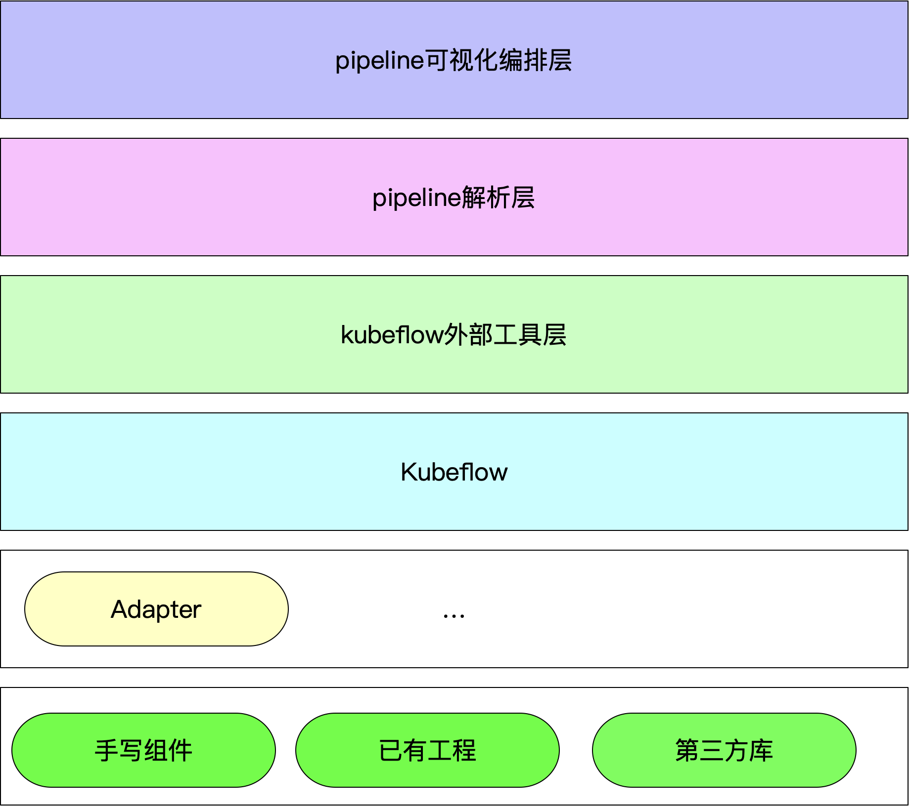

# 组件全流程开发思路总结

## 基于Kubeflow的分布式组件化开发框架方法

​		kubeflow主要的功能之一是pipeline，每一个pipeline是由多个运算组件(component)前后连接组成。我们只需要使用kubeflow官方python SDK进行开发组件代码，开发完成之后进行编译便可以得到组件对应的yaml文件，当我们需要使用组件的时候只需要根据URL加载组件yaml为组件即可调用。同时可以将组件放在统一的一个地方，当需要构建pipeline的时候直接去组件仓库中挑选出需要的组件，加载到当前pipeline中，并以数据为驱动进行pipeline的前后连接，连接好之后进行编译，SDK会将pipeline代码编译为一个pipeline的yaml，将yaml提交到kubeflow的pipeline功能中就可以对pipeline进行计算了，在计算的过程中，对pipeline中组件的调度和数据的传输都是kubeflow来完成的，开发者只需要关注组件本身的编写以及pipeline的构建。

## 基于kubeflow的可视化pipeline构建计算平台框架

​		当前平台上的组件可以来自于三个部分，我们需要将这三部分的代码都转化成kubeflow pipeline的组件代码，根据这三种代码的不同我们需要存在不同的代码标准和转换标准，再根据转换标准转换成为统一可调用的组件。我们可以将整个系统从下到上分为6层。最下层的功能组件层、组件层上的组件之间结合的适配器层、kubeflow中的调度器和支持层、外部工具层、pipeline解析层、pipeline可视化编排层。

顶层用户使用可视化的方法在pipeline可视化编排层编排pipeline流程，编排好之后进行提交，此时编排好的pipeline组件描述文件会进入pipeline解析层进行解析，并生成pipeline的python SDK描述代码，并对描述代码进行编译得到pipeline的yaml描述文件，此时将描述文件上传到kubeflow外部工具的pipeline层进行pipeline的添加和执行，此时一个完整的pipeline就可以在kubeflow上执行了。



这三部分组件都必须要满足以下规则：

+ 组件的输入和输出都是数据而不是方法或者是引用
+ 组件内部形成闭包并且组件内部是一个单独运行的容器，不能够对组件外部的变量和方法进行调用
+ 方法内部注释不能存在中文 

组件开发的三个部分：

+ 从头开发一个组件

  如果从头开发一个组件的话我们需要满足一定的开发规范并使用Pipeline SDK进行开发。

  + 组件的输入数据和输出数据都应该是SDK中元数据的形式
  + 导包语句应该在方法内部，不能够在方法外部
  + 需要在组件声明的装饰器上注明需要安装的包

  案例：

  这是原本代码的写法。

  ```python
  import numpy as np
  from sklearn.datasets import make_moons, make_circles, make_classification
  def make_classification_com():
      X, y = make_classification(n_features=2, n_redundant=0, n_informative=2,random_state=1, n_clusters_per_class=1)
      return X,y
  ```

  上述代码如果使用组件开发的写法应该如下所示：

  ```python
  import kfp
  from kfp.v2 import dsl
  from kfp.v2.dsl import component, Input, Output, OutputPath, Dataset, Model,InputPath
  import kfp.components as comp
  
  @component(output_component_file='make_classification_com_component.yaml', packages_to_install=['joblib', 'numpy','sklearn'])
  def make_classification_com(make_classification_com_output:Output[Dataset]):
      from sklearn.datasets import make_moons, make_circles, make_classification
      import numpy as np
      import joblib
      (X, y) = make_classification(n_features=2, n_redundant=0, n_informative=2, random_state=1, n_clusters_per_class=1)
      joblib.dump({'X': X, ' y': y}, make_classification_com_output.path)
  ```

  在代码顶部应该存在对pipeline SDK的导包。

  代码的第一行是表示当前方法是一个pipeline组件的装饰器，装饰器里<code>output_component_file</code>描述了当前方法转换成组件时yaml文件的存储位置和文件名，<code>packages_to_install</code>属性描述了当前方法所依赖的第三方包，在这些包后面可以设置版本号。

  在组件方法的定义语句中，方法的输入参数建议都是用元数据输入的方式如：<code>def rng_uniform(X_input:Input[Dataset]):</code>。方法的返回不建议是直接return的方式而应该是通过方法的返回元数据的方式，如：<code>def rng_uniform(rng_uniform_output:Output[Dataset]):</code>输出的元数据也是通过方法参数的形式传入组件方法内部。方法内部对数据进行一定的逻辑处理，逻辑处理完成之后将处理结果保存到方法输入的输出元数据中。

+ 基于已有工程开发

  我们这里所说的标准化和非标准化指的是相对于我们提出的是否符合kubeflow组件转换标准，如果当前已有的工程满足组件的开发标准那就是标准化的代码，如果不属于则是非标准化的代码。对于非标准化的代码我们应该先人工/自动的将其转换为标准化的代码之后再使用标准化代码的转换方式进行转换。

  组件转换标准：

  + 代码内不允许存在中文注释（在kubeflow中，若代码内存在中文字符则无法运行）

  + 代码是可运行的、没有语法错误的，若代码出现语法错误，代码在进行转换时将会抛出异常

  + 代码方法返回值不允许是表达式、方法调用、数据类型的初始化等，只能够是变量

  	+ 正确的返回方式

  		```python
  		res_model = model - y
  		return res_model
  		```

  	+ 错误的返回方式

  		```python
  		return model - y
  		return {"aa":a}
  		return func()
  		return [1,2,3,4]
  		```

  标准化的代码：

  ​	    对于标准化的代码我们可以使用**ast**的将代码进行规则进行转换，将标准化的代码批量转换成为标准的kubeflow pipeline的组件代码。

  ​	    AST (Abstract Syntax Tree(抽象语法树)) 是源代码语法结构的一种抽象表示。它以树状的形式表现编程语言的语法结构。它由一堆节点（Node）组成，每个节点都表示源代码中的一种结构。

  ​		在python中，内置了ast包，能够将传入的代码生成AST，并且能够使用ast的内置api对AST进行遍历和处理，在python的ast包中提供了两个类对ast进行处理，分别是<code>class ast.NodeVisitor</code> 和 <code>class ast.NodeTransformer</code>这两个的区别就是visit是修改原来的node,transformer可以替换一个新的node。这两种类采用的对AST遍历的方式都是递归遍历，结合当前代码处理的需求，我最终选择了后序遍历，在遍历过程中对节点进行处理和替换，并选择使用<code>ast.NodeTransformer</code>类进行处理。

  ​		在使用ast之后，对代码种类的判断可以直接交给ast包内置的api来实现，我们只需要关注对不同种类的代码进行不同的处理即可，当实现了对应节点的visit方法以后便可以对指定的节点进行处理，每一个种类的节点都是一个实体类，对节点内的代码处理就是对实体类进行处理，并返回修改或者是新生成的实体类便可以便可以完成一个节点的替换。对抽象语法树上的每一种节点进行处理对应的是一个遍历类中不同的处理方法，其优点是能够将不同节点的处理逻辑分开来，提高代码的可维护性，提高程序的健壮性。代码可复用性强，粘连性低。并且不用特定的去匹配指定的语句，不同的语法结构有不同的节点来表示，对一种节点下的其他节点能够使用递归的方式遍历到，因此采用合适的递归方式就能够找出当前节点的所有子节点进行处理。

  ​		在ast包使用的过程中同时也发现了使用ast仍然不能很好解决的问题，在AST中，return返回代码的定义是一个Return节点，这个节点的value是return内表达式的节点，但是return可以返回很多种种类的值，不仅仅是变量，还可以是表达式或者是方法的调用等等，因此没办法使用ast对返回值进行处理。也因此采用了字符串的方式处理了这部分代码。

  ​		在使用ast对代码进行处理之后，我们能够更加快捷方便的对整个代码进行处理，能够使用一定的结构方法去操作代码块，同时能够处理整个项目中的代码，而非局限于一个.py文件内的代码，对代码的处理消除了想不到的书写模式。能够精确的定位到方法代码中对其他方法的调用等。使得代码更加的规范，兼容性更强。

  非标准化的代码：

  非标准化的代码就是不满足标准化的条件，一般不满足最多的便是**代码返回值**问题。在处理这一类问题时我们可以将return中的表达式、复杂数据类型初始化等代码转换成变量再将变量进行返回的方式将非标准化的代码转换成标准化的代码。

+ 第三方库

​		在第三方库的代码转换中，如果是直接对第三方代码的每一个方法进行转换，将会出现一个复杂方法的方法比较多，方法链式调用过长的情况，因此在第三方库的代码转换上我们不应该对第三方库的所有方法/部分方法进行直接的转换，而是应该在第三方库的api方法外部使用一个方法来对api进行调用，然后对这个方法进行转换，这样就避免了对api方法内部的方法调用栈进行处理，同时简化了代码的处理逻辑。但我们就应该选择出一种比较合适的方法调用方法的生成逻辑，对第三方库的api方法进行调用代码的生成。

### 第三方库和已有工程代码的转换

在代码的转换工作中，我们需要先去扫瞄所有的代码，并使用ast识别代码的结构，根据不同代码的结构拟定出代码处理和转换的规范，根据规范转换代码。针对**第三方库代码**的转换工作主要有两种方式：

+ 直接对第三方库代码进行转换

	直接对库代码进行转换需要扫描第三方库代码的所有方法，并将方法进行转换，具体的转换步骤如下所示：

	+ 读取源代码，将代码使用ast包转换成ast对象，并传入visit类进行遍历
	+ 首先使用循环的方式遍历一遍源代码的所有顶层节点，将方法节点对应的方法名和方法节点类放到一个字典中以供后序调用。
	+ 添加visit_ClassDef扫描类定义，将类定义的代码添加到字典中。
	+ 在ast.NodeTransformer实现类中添加不同节点的实现方法：visit_Import、visit_ImportFrom、visit_Return、visit_FunctionDef、visit_Call，不同的vist方法使用的是不同节点的访问方法。
	+ 采用后序遍历的方式，首先遍历一个节点的所有子节点，获取到全局的导包语句、当前方法节点的子节点中的其他方法调用节点。将全局的导包语句都存储到list中，将调用其他方法节点获取到之后获取被调用方法的方法名。
	+ 大多数的逻辑写在visit_FunctionDef方法中，这是方法定义节点的处理方法，这个方法会在当前方法节点所有子节点visit之后调用，首先遍历方法的参数节点，将参数节点的参数名和参数类型进行重新处理，添加返回参数元数据形参，并替换掉原来的形参节点。
	+ 在方法体的下一行添加导包语句节点，体现在代码上就是在方法定义语句的下一行添加导包语句
	+ 添加完导包语句之后添加当前方法所调用方法的方法节点。获取到存储的方法节点，获取到方法节点之后添加到导包节点之后。扫描方法节点的同时扫描类的初始化调用节点，如果有的话就将类代码添加到导包节点之后
	+ 添加调用方法节点之后添加原有形参还原的代码节点。获取到原有形参名，使用字符串拼接的方式拼接出从元数据中加载数据的代码，并使用ast包转换为AST节点，并将节点添加到方法定义语句之后
	+ 获取到Return节点，将return节点还原为字符串形式的代码，使用字符串的形式进行返回元数据的封装和逻辑代码的生成，生成之后使用ast包封装为node节点并替换原有的return节点。
	+ 使用字符串的形式生成组件装饰器代码，并使用ast包转换为装饰器节点添加到方法节点的指定属性上。
	+ 将修改好的ast转换为代码，并将代码写入python文件中。

	但是这种转换方式会存在比较多的**问题**：

	+ 方法的调用链比较复杂，很容易出现栈溢出的情况

	+ 有些方法底层非python实现，因此方法体直接是<code>pass</code>这一类方法转换出来之后不能运行

		```python
		    def __init__(self): # known special case of object.__init__
		        """ Initialize self.  See help(type(self)) for accurate signature. """
		        pass
		
		```

+ 在第三方库代码API方法的外部进行一层方法调用包裹，对方法调用进行组件转换

​			在方法外部进行包裹，并将包裹代码进行转换的方式虽然简单，但是批量生成包裹代码是否可行任然是一个问题（还没仔细研究过）。包裹代码如下所示：

```python
def get_randomforest(n_estimators=100,
                     criterion="gini",
                     max_depth=None,
                     min_samples_split=2,
                     min_samples_leaf=1,
                     min_weight_fraction_leaf=0.,
                     max_features="auto",
                     max_leaf_nodes=None,
                     min_impurity_decrease=0.,
                     min_impurity_split=None,
                     bootstrap=True,
                     oob_score=False,
                     n_jobs=None,
                     random_state=None,
                     verbose=0,
                     warm_start=False,
                     class_weight=None,
                     ccp_alpha=0.0,
                     max_samples=None):
    rfc_train = RandomForestClassifier(n_estimators=n_estimators,
                                       criterion=criterion,
                                       max_depth=max_depth,
                                       min_samples_split=min_samples_split,
                                       min_samples_leaf=min_samples_leaf,
                                       min_weight_fraction_leaf=min_weight_fraction_leaf,
                                       max_features=max_features,
                                       max_leaf_nodes=max_leaf_nodes,
                                       min_impurity_decrease=min_impurity_decrease,
                                       min_impurity_split=min_impurity_split,
                                       bootstrap=bootstrap,
                                       oob_score=oob_score,
                                       n_jobs=n_jobs,
                                       random_state=random_state,
                                       verbose=verbose,
                                       warm_start=warm_start,
                                       class_weight=class_weight,
                                       ccp_alpha=ccp_alpha,
                                       max_samples=max_samples)


    return rfc_train
```

在对已有工程进行转换的时候和第三方库的第一种转换方式一样，需要将调用到的方法都写到当前转换的方法中来。

## 工程项目代码为中心

从数据的角度来说，我们可以将方法看作是对数据处理的一个步骤，在此情况之下我们可以对数据处理的步骤进行分类。一般可以对数据处理操作节点（组件）从功能上分为以下几类：

+ 数据的加工处理
+ 数据的转换
+ 数据建模
	+ 训练
	+ 测试
+ 可视化展示

从代码结构层面可以归为以下几类：

+ 无数据输入有输出:这种组件只需要返回处理之后的数据。常见的此类组件如数据加载组件，需要处理的数据存储在不同的服务器上，需要加载过来，因此使用数据加载组件加载特定的数据，并将数据以元数据的形式进行返回。

+ 有数据值的输入和输出：这种组件的输入值，将输入值计算之后以元数据的形式进行输出。此类组件属于最常用的组件，能够完成数据的输入处理输出。

+ 循环子图：使用kubeflow SDK的特殊装饰器，声明当前组件是一个循环子图，在组件中可以调用其他组件，并在满足一定条件时递归执行当前子图，此类组件不是严格意义上的组件，也可属于pipeline的一部分。此类组件的使用场景：持续训练，并获取每一次训练的均方误差。当每一次调用循环子图计算之后判断均方误差，如果如果均方误差值大于预先设置的阈值的话就持续执行当前循环子图。其代码如下所示：

	```python
	@kfp.dsl.graph_component
	def train_until_low_error(starting_model, training_data, true_values):
	    # Training
	    model = xgboost_train_on_csv_op(
	        training_data=training_data,
	        starting_model=starting_model,
	        label_column=0,
	        objective='reg:squarederror',
	        num_iterations=50,
	    ).outputs['model']
	
	    # Predicting
	    predictions = xgboost_predict_on_csv_op(
	        data=training_data,
	        model=model,
	        label_column=0,
	    ).output
	
	    # Calculating the regression metrics    
	    metrics_task = calculate_regression_metrics_from_csv_op(
	        true_values=true_values,
	        predicted_values=predictions,
	    )
	
	    # Checking the metrics
	    with kfp.dsl.Condition(metrics_task.outputs['mean_squared_error'] > 0.01):
	        # Training some more
	        train_until_low_error(
	            starting_model=model,
	            training_data=training_data,
	            true_values=true_values,
	        )
	
	```

	

+ 有数据输入，无数据输出的组件：这一类组件同样是将输入的代码进行计算，无数据输出只是针对于组件来说是无数据输出，其计算的数据可以通过其他形式输出到其他地方，如将数据上传至另一服务器等。

+ 无数据输入无数据输出：此种类型的组件没有对于组件来说的数据输入与输出，其使用场景可以为：从其他服务器进行数据加载，加载完数据之后对数据进行一定的处理操作，处理完数据之后将组件输出回数据源服务器。 

由以上组件的分类可以分别得出组件的开发规范，以下规范都是在满足基本的开发规则之后的规范。方法的输入和输出参数推荐全部使用元数据输入的形式，不建议使用直接数据输入和直接返回的形式。推荐写法如下所示，需引入pipeline开发的SDK，然后添加组件的装饰器并填入相应的信息。在方法的定义语句中所有的参数都推荐使用元数据的方式，在方法内将元数据读取出来，当数据处理完成之后，将数据存入指定的元数据落地位置即可。

```python
# 脚本添加的导的kubeflow pipeline SDK需要导入的包
import kfp
from kfp.v2 import dsl
from kfp.v2.dsl import component, Input, Output, OutputPath, Dataset, Model,InputPath
import kfp.components as comp

import requests
import numpy as np
import pandas as pd
# 生成的组件添加组件标识的装饰器，装饰器第一个参数是将此方法转换为组件yaml代码的文件名 第二个参数是当前组件需要用到的第三方包
@component(output_component_file='load_data_component.yaml', packages_to_install=['joblib', 'requests', 'numpy', 'pandas'])
# 组件方法定义   将原有方法的形参转换为输入元数据的形参并指定元数据类型为Input[Dataset]  并在形参上添加输出数据的元数据
def load_data(url_input:Input[Dataset], filename_input:Input[Dataset], url1_input:Input[Dataset], load_data_output:Output[Dataset]):
#     脚本扫描到当前组件所在源代码中引用的第三方包，然后将这些第三方包添加到组件方法内（因为组件方法外的包在组件打包的时候扫描不到）
    import requests
    import numpy as np
    import pandas as pd
    import joblib

    url = joblib.load(url_input.path)['url']
    filename = joblib.load(filename_input.path)['filename']
    url1 = joblib.load(url1_input.path)['url1']
    f = requests.get(url)
    with open(filename, 'wb') as code:
        code.write(f.content)
    a = pd.read_excel(filename)
    xdata = a[['t', 'X_t_1', 'X_t_2', 't_T_1_X_t_1', 't_T_2_X_t_2', 'H_t', 'ck1', 'sk1', 'ck2', 'sk2']]
    ydata = np.log(a['Y'])
#     将组件的返回参数转化为字典的方式并落地到输出元数据指向的地方
    return joblib.dump({'xdata': xdata, ' ydata': ydata}, load_data_output.path)
```


