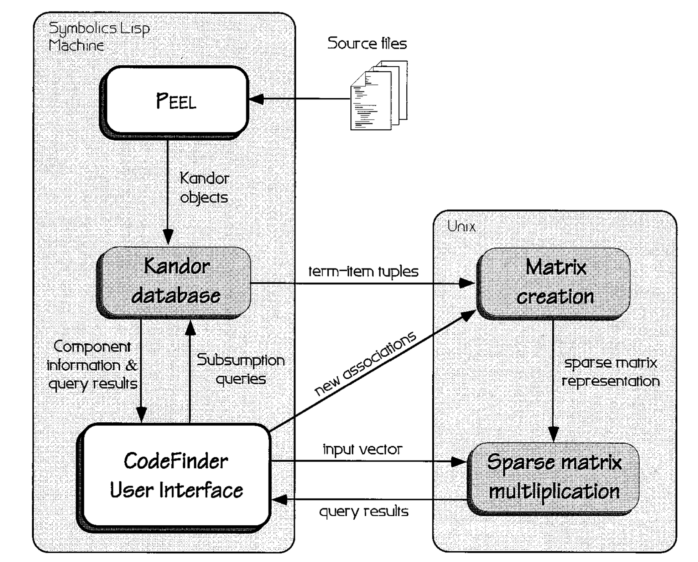

# 构建有效软件重用存储库的渐进方法

**文章的目的**：描述软件存储库的索引和检索问题，并提供一组旨在支持组件存储库增量优化的工具。

PEEL是一种半自动识别可重用组件的工具， CodeFinder是一种检索系统，通过扩展激活检索过程来弥补显式知识结构的不足

## 其他的检索算法

其他检索算法：枚举分类、刻面分类、基于框架的分类、自由文本索引、关系数据库、规格说明法。

在进行组件存储和检索的时候需要有一个预定义的结构，然后在进行存储的时候需要分类存储，这种方式成本较大。并且检索所需要的结构也是静态的，无法适应动态的环境，并且进行动态的修改结构时复杂度较高。

## 2.使用组件存储库支持软件重用

有两种基本技术已经用于软件重用方法中：基于组合的重用（也称为基于部件或基
于组件的重用）和生成技术（基于语言的重用）

> 因此组合、组件、部件都指的是组件

**基于组合的重用**

组件的定义：

组件是*自包含*的实体，例如程序库、数据结构、程序、对象等。

> 自包含：本身含有，不需要依赖其他程序
>
> 自包含(self-contained)是指在组件重用时不需要包含其他的可重用组件
>
> 

重用这些组件是通过开发人员人工完成的。

> 种方法我理解为是类似于开源库中的API代码，使用时直接调用。

**生成技术**

生成方法与编译器技术密切相关，在编译器技术中，用户选择调用参数化代码片段来创建定制的应用程序。

> 我理解为这种方法是根据参数配置生成代码片段

### 2.1 组件存储库

用于软件存储库的检索方法可分为三类：枚举分类、刻面和自由文本检索

**枚举分类**

> 通过定义一个层次结构来描述组件，在该结构中定义软件构件的类以及子类的不同层次。把实际的构件罗列在枚举层次的适当路径的最底层

信息被放置在通常以子类别层次结构构成的类别中。

分类方案的吸引力在于能够迭代地将信息空间划分为更小的部分，从而减少需要仔
细阅读的信息量。

枚举分类涉及的问题：固有的不灵活性和理解大型层次结构的问题

> 其分类结构层次是不灵活的，一旦结构划分完毕，如果再进行结构的变更的话会对整个分类都产生影响。

枚举分类要求用户了解存储库的结构和内容，以便有效的检索信息。

**刻面分类法（Faceted classification）**

> 使用一组刻面来对构件进行分类的方法。刻面是一个单词或短语的固定集合，用于描述构件的某个方面或视角。[刻面分类法](https://www.termonline.cn/search?k=%E5%88%BB%E9%9D%A2%E5%88%86%E7%B1%BB%E6%B3%95&r=1656251207699)
>
> 刻面分类法是将描述构件本质特征的属性视为若干个独立的“面”，每个刻面从不同视角对构件库的构件进行划分。

通过定义不同的属于实例化属性类，避免层次结构中组件定义的枚举。在关系模型中术语被分组为固定数量的互斥方面。用户通过为每个面指定一个术语来搜索组件。

刻面的缺点：

​	用户很难找到正确的术语组合来准确描述信息需求。

term

> [术语](https://zh.wikipedia.org/zh-cn/%E6%9C%AF%E8%AF%AD)

**自由文本检索**

使用文档中的文本进行索引。其中删除文档中的停用词后的其他词作为文档的索引。

> 我理解为根据文档进行检索？根据相应的关键词

自由文本检索构建和检索比较简单，但是依赖于语言文本中的规律行，这些规律的准确性建立在大量文本统计的基础之上。

自由文本检索最适用于包含大量文档的领域。

自由文本检索方法构建存储库的成本较低并且构建性能比较好，但是，在文本密集型领域的效率不高

### 2.2存储库结构和检索效率

结构与有效检索之间的关系是什么？使用最小结构的存储库是否
可以实现足够的检索效率？

这些方法定义了一个连续体，需要广泛结构的jkl类到需要较少结构的刻面l 类，到需要结构的自由文本索引

使用复杂信息结构的方法的优势在于，人们可以使用结构中包含的知识来引导他们获得相关信息，缺点是如果信息的结构与用户期望不一致，则不可能提供支持。

## 3  CODEFINDER：软件重用的信息访问

本文描述的原型系统称为PEEL（Parse and Extract Emacs Lisp），它从文本文件中提取组件，并通过自动提取和交互式用户支持的组合对其进行索引。

相关反馈和自适应索引是两种可以用来改进存储库结构的方法

这种方法的总体优势是，成本是根据需要递增的，而不需要大量的前期存储库设
计工作

存储库需要（1）创建初始信息结构的工具，（2）灵活的搜索和浏览存储库（3）在用户使用存储库时优化和调整信息的工具。

CodeFinder和PEEL的结合通过支持源代码组件半自动提取、查询构造技术和自适应索引设施的方法实现了这一目标。

> 我理解的就是使用PEEL从文档中半自动的提取组件，并使用半自动的方式对其添加索引

### 3.1 CodeFinder PEEL存储库

CodeFinder和PEEL旨在研究与构建和使用存储库来支持设计过程相关的成本/收
益权衡。

> 举了一个使用他们的例子

组是Emacs Lisp函 数变量和常量，它们定了可Emacs文本编辑器境执行的两个电子邮 和个网络新闻阅读器/程序

源码是专门讨论Emacs和Emacs LISP问题的各种新闻组中取的， 包括 comp . emacs , gnu.emacs .sources ,及更专业的团体，比如gnu.emacs . gnus and gnu.emacs .vm.info通过对PEEL 的适度努力，创建了一个由1800多 个Emacs LISP函数、变量、宏和常量及大2900个术语组的存储库

## 4. 为存储库设定种子

种子库是通过使用关键术语和短语对组件表示进行索引来创建组件表示的问题。组件可以采用任何大小或形式，具体取决于存储库用户的需要

PEEL是一种再工程工具，它将Emacs Lisp文件转换为基于框架的知识表示语言Kandor中的单个可重用组件 

Kandor表示可以被视为一组属性/值槽，其中包含有关给定组件的信息 。PEEL用于捕获该信息并将其放置在Kandor插槽中

PEEL使用**三步程序**处理术语，类似于在Basili的软件工厂提取组件的过程

+ 第一步是完全自动化的。术语是从函数名和定义内或定义前的任何字符串或注释中提取的。 
+ 第二步是向用户显示术语，用户可以删除术语，截断列表并在源代码窗口中突出显示术语，以显示术语的使用方式和位置
+ 第三步允许用户添加自己的术语，包括短语（用空格分隔的单词）和任何其他标点符号。

CodeFinder还创建指向组件调用的所有函数的超链接，只需单击鼠标即可显示组件的直接子系统。

> Halstead和McCabe指标可以用来度量组件的好坏

## 5. 补偿不完整和不一致的索引

信息检索接口需要解决两个主要问题：

+ 第一个是设计问题的本质，在设计过程中，人们对需要什么以及应该如何解决问题有一个不明确的概念
+ 第二个问题是，文档索引通常不一致且不完整。

> 人们根据关键词检索组件的时候，对同一个组件的描述可能不同，因此，在做组件检索的时候应该推荐关键词相关功能的组件。

不一致的索引总是存在的，因此有必要使用超越简单的关键字匹配方案的检索方法和算法

搜索过程还应该找到类似解决方案的组件

“智能”检索由关联扩散激活检索算法提供【Mozer 1984】，该算法扩展了精确匹配范式，以检索与查询关联的项目。该算法扩展了精确匹配范式，以检索与查询关联的项目

> 研究表明这个算法挺有用

### 5.1 扩展激活检索

CodeFinder构建一个关联网络，然后，将基于连接主义松弛检索过程的关联扩展激活过
程应用于网络以检索信息

IDF 

**逆文档频率(inverse Document Frequency，IDF) **是一个词语普遍重要性的度量，它的大小与一个词的常见程度成反比，计算方法是语料库的文档总数除以语料库中包含该词语的文档数量，再将得到的商取对数。

5.1.1 计算激活值

5.1.2 扩展激活算法的参数

5.1.3 链接权重

5.1.4 通过内容诱导结构定义关系

### 5.2 通过改写进行检索

除了软匹配算法，检索系统还可以通过支持查询构造过程来减少不良存储库结构 的 影 响 。

>  这种查询算法在用户进行查询输入的时候会对查询进行一定的格式化响应，提示响应的词是存储库中用于索引的术语.也就类似于百度搜索时推荐的搜索。

用户 可以通过对以前查询的结果进行批评性分析来逐步改进查询。

CodeFinder通过在接口中提供大量检索线索，支持通过重新格式化进行检索。

> > 在检索的时候可以添加一定的属性？

CodeFinder通过三种方式重新格式化范式来增强检索。

+ 项目会自动放置在查询的适当部分
+ CodeFinder对检索集 强 加 一 个 排 名 标 准 ， 自 动 显 示 查 询 的 评 分 最 高 的 项 目
+ 第三，CodeFinder在[相关术语]窗格中显示术语,这些术语还按照与查询相关的顺序进行排序，并可用于细化查询。

## 6.     支持组件存储库的增量提细化工作

需求和观点对不同时间具有不同信息需求的个人以及不同背景的不同用户都不同。因此，不能预先设计有效的存储库结构；必须允许它们在使用的环境中发展。

组件存储库的最终目标是创建一个“类似于大多数在应用程序领域工作的程序员所拥有的知识结构的索引方案”

捕获典型使用情形的最佳机会是提供在使用期间轻松修改存储库的方法。

### 6.1 在使用环境中调整存储库

通过记录用户操作并根据这些操作增量更改表示，应用了改进存储库的自适应技术。当用户与系统交互时，系统将使用通常由用户确定的各种应用目标向索引方案迁移

> 根据用户搜索的关键词，让索引向这些关键词中迁移 

总体目标是让系统逐步构建用户知识的共识表示，该表示可以随着组织知识的发展而改变。

> 我理解的意思是：让组件库的组件索引和用户的认识以及描述靠近

Bellcore对人们选择术语来描述常见对象、烹饪食谱、编辑器命令和其他项目的研究显示，两个人为这些对象选择相同关键字的概率在10%到20%之间[Furnas et al. 1987] 使用15个别名可以达到60%-80%的一致性，使用30个别名可以获得高达90%的一致性。

> 我理解的意思是：给一个组件不通的描述，这些描述都指向同一个组件，

无限混叠方法的问题之一是可能会出现精度问题。 如果更频繁地使用术语来描述存储库中的对象，则系统检索不需要的对象的概率会增加。对使用大量别名的检索系统的研究表明，精度问题没有理论预期的那么严重

> 这种方法在检索对象时，用户表示成功检索，然后就把用户输入的关键词加入到这个对象的别名列表中

将所有这些术语添加到所选项目中可能会增强该项目未来的可检索性，但我们必须防止检索会话中使用拼写错误或不良术语的情况。

### 6.2 通过相关性反馈调整链接权重

除了为组件表示分配新术语外，代码查找器还使用相关性反馈来调整术语组件链接权重。相关反馈通常用于重新表述查询，通常是通过将文档的表示添加到查询中

> 组件和组件描述之间添加一定的权重来获得更好的检索结果，

## 7编解码器的设计与评价

### 7.1实施

PEEL将E-lisp源文件作为输入，并生成Kandor对象。

> 讲一些具体的做法

### 7.2 CodeFinder的经验评估

进行了一项实验，评估CodeFinder的接口和具有最小结构的检索方法和有效性。

任务属于定义不明确或词汇不匹配的类别时，CodeFinder在这些类别中得分最高

当问题定义不明确或词汇表不匹配时，CodeFinder表现比一般的匹配算法要好很多。

## 8. 结论和未来方向

文中描述的工作源于对软件开发工具的需求，这些工具支持查找要重用的组件 的过程。

当前实用和固有的环境导致很难创建存储库。设计问题的定义不明确使得很难为组件创建索引，让组件能被重用。另一个问题是，软件设计过程中术语和别名较多，很难通过这些术语和别名精准的找到当前需要使用的组件。

组件库创建检索结构一般是静态的，无法适应动态的开发环境。并且如果需要对结构进行变更的话需要重新设计整个存储库，需要的成本较大。

**解决这些问题的方法**

+ 以最少的索引和结构化工作提供足够的检索效率
+ 助该设备随着软件开发组织中人们不断变化的需求而发展。
