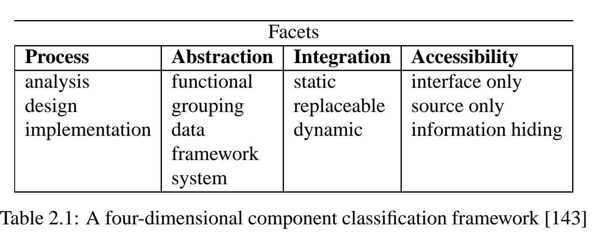

# A Survey For Effective Search And Retrieval Of Components From Software Repositories

PEEL extracts source code definitions of functions, constants,variables and macros from a source code file

PEEL从源代码文件中提取函数、常量、变量和宏的源代码定义

然后将这些信息提取并翻译成kandor对象.Kandor表示可以被视为一组包含组件信息的属性

# An Evolutionary Approach to Constructing Effective Software Reuse Repositories

PEEL（Parse and Extract Emacs Lisp）从文本文件中提取组件，并通过自动提取和交互式用户支持的组合对其进行索引。

PEEL使用三步程序处理术语：

+ 第一步是完全自动化的。术语摘自函数的名称以及定义之前的任何字符串或注释。将公共停止列表应用于提取的术语，以删除几乎没有语义含义的常见单词。
+ 第二步是向/户显示术语。用户可以删除术语、截断列表、在源代码窗口中高亮显示该术语，以显示该术语的使用方式和位置。
+ 第三步允许用户添加他们自己的术语，其中可以包括短语(用空格分隔的单词)和任何其他标点符号。

# **Mining Component Behavior to Support Software Retrieval**

> 这篇论文主要是描述的如何生成组件的描述
>
> 本文讨论(1)不基于自然语言文本的VON软件描述的自动生成和(2)依赖于(1)中开发的描述的软件检索。

> 组件检索中比较重要的是组件描述。在这个论文中他们开发出了自动描述可复用组件的方法。

## 组件库

从领域工程师的角度来看，组件库是存储库管理员放入生成的资产的地方。

从应用工程师的角度来看，组件库是他/她获取当前正在进行的开发的构建块的地方。

### 组件

#### 组件作为方法（功能）实体

+ 软件组件是具有良好定义和发布的接口的可执行软件的物理打包。
+ 软件组件是独立生产、获取和部署的二进制单位，相互作用形成一个功能系统的一部分。”此外，该定义强调可执行性、接近性（至少通过用作二进制软件包）以及通过组件的接口的可访问性。此外，有人强调，组件并不存在，而是构成更大系统的基石
+ 关于组件的结构和功能的知识可以是可访问的，也可以是不可访问的，但是接口必须被明确地定义，其包括所提供的服务以及如何访问它们的完整列表、一般依赖关系或可能的错误条件。

#### 作为抽象载体的组件

组件(根据体系结构风格，组件的同义词是筛选器、对象、进程)被理解为通过连接器链接到其他组件的功能(域)实体

#### 作为可重复使用的构建块的组件

一个组件也应该有可能被其他程序员使用，只有当它的接口和环境依赖被很好地设计和记录时才可能是这种情况。

## 自动获取描述（Obtaining descriptions automatically）

#### 四维分类框架

可以根据软件过程、抽象、集成和可访问性四个方面对组件进行分类。

+ 过程：软件流程方面决定了组件可以在软件流程的哪个阶段使用。这从分析阶段到设计和实施阶段。请注意，Meyer不将测试用例视为组件，这从他的框架中排除了软件开发过程的后续阶段。此外，这个方面明确强调不是编程元素的组件！

+ 抽象：抽象水平根据其普遍性来描述该组件。考虑不同的观点，即功能抽象、相关元素组、数据抽象、框架或系统抽象。函数抽象是自包含功能的表示，由传统软件库中已知的子程序或函数表示。分组是一组收集的任意相关元素。数据抽象可以是命令式语言中的数据胶囊，也可以是面向对象语言中的类，涵盖数据实体。更高的抽象是通过框架实现的，这些框架必须根据一套规则使用。最高级别的抽象是通过使用粗粒度二进制组件实现的。由于面向对象技术的成熟度，它们可以在COM、CORBA或JavaBeans架构的基础上使用。

+ 集成：集成级别指的是组件集成到软件系统中的时间点。Meyer确定了三个不同的时间点：静态执行是指在编译时或链接时集成(它们在不重新编译的情况下是不可更改的)，可替换组件也在编译或链接时集成，但具有一定的动态可变性，以及动态组件，它们在系统执行时集成

+ 可访问性：可访问性级别来自开发人员可以使用组件的形式。在这里，可以识别三种不同的模式：通过接口描述进行交流，其中不能看到源代码。仅源代码访问，开发人员必须详细了解代码，以确定其功能。当通过接口提供访问权限时，还会提供信息隐藏信息，此外，源代码可用于检查、讨论和更正。分类模式的压缩视图见表2.1

	

组件可以是函数、模块、对象或对象的簇；它们可能以源代码的形式出现，也可能以可执行状态出现。来自需求阶段或分析阶段的资产、测试文档和测试用例不被称为组件，因为这些产品不能被客户直接使用。组件是为系统提供重要功能的构建块。软件开发人员可以使用“真正的”组件来构建组件作者无法预见的新系统。这一目的再次将术语组件转移到重用领域。

# Extracting information from Python source code

[Extracting information from Python source code ](https://developers.redhat.com/articles/2022/01/05/extracting-information-python-source-code#) 从python源文件中检索导包信息

# Component-Based Architecture

[Component-Based Architecture](https://www.tutorialspoint.com/software_architecture_design/component_based_architecture.htm)

组件将软件元素的功能和行为封装到可重用和自部署的二进制单元中。

面向组件的软件设计具有很多优势：

+ 通过重用现有组件，缩短了上市时间和开发成本。  （节约时间、开发成本）
+ 通过重用现有组件提高了可靠性。

### 组件的定义

组件是一组模块化、便携式、可替换和可重用的清晰定义的功能集，可以封装其实现并将其导出为高级接口。

组件是一个软件对象，旨在与其他组件交互，封装某些功能或一组功能。它有一个明确定义的接口，并符合推荐的体系结构内所有组件通用的行为。

软件组件可以定义为具有合同规定的接口和显式上下文依赖关系的组合单元。也就是说，软件组件可以独立部署，并由第三方组成。

### 组件的特性

可重用性：组件通常被设计为在不同应用的不同情况下重复使用。然而，一些组件可能是为特定任务设计的。

可替换性：组份可以自由地用其他类似的组份替代。

没有特定的环境：组件设计为在不同的环境和上下文中运行。

可扩展性：组件可以从现有组件扩展以提供新的行为。

高度封装：组件描述允许调用者使用其功能的接口，并且不公开内部流程的细节或任何内部变量或状态。

独立的：组件被设计为对其他组件具有最小的依赖关系。

## 组件级设计指南

为指定为体系结构模型一部分的组件创建命名约定，然后作为组件级模型的一部分进行细化或细化。

+ 从问题域中获取体系结构组件名称，并确保它们对查看体系结构模型的所有涉众都有意义。
+ 提取可以独立存在而不依赖于其他实体的业务流程实体。
+ 将这些独立实体识别并发现为新组件。
+ 使用反映其实现特定含义的基础结构组件名称。
+ 从左到右建模任何依赖项，以及从上级（基类）到下级（派生类）的继承。
+ 将任何组件依赖项建模为接口，而不是将它们表示为直接的组件到组件依赖项。

## 组件化的好处

+ 易于部署− 随着新的兼容版本的推出，在不影响其他组件或整个系统的情况下，更容易替换现有版本。
+ 降低成本− 使用第三方组件可以分摊开发和维护成本。
+ 易于开发-组件实现众所周知的接口来提供定义的功能，允许开发而不会影响系统的其他部分。
+ 可重用−可重用组件的使用意味着它们可以用于跨多个应用程序或系统分摊开发和维护成本。
+ 技术复杂性修改− 组件通过使用组件容器及其服务来修改复杂性。
+ 可靠性-整体系统可靠性提高，因为每个组件的可靠性通过重用提高了整个系统的可靠性。
+ 系统维护和进化-易于更改和更新实现，而不会影响系统的其他部分。
+ 独立的− 组件的独立性和灵活连接。由不同组并行独立开发组件。软件开发和未来软件开发的生产力。